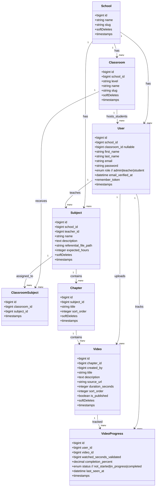

# SCHEMA_BDD - Monto V2 (MVP)

Version: 2026-04-16
Source: consolidation de [File-rouge.md](File-rouge.md) + brouillon [Migration.drawio.png](Migration.drawio.png)

## Objectif
Ce schema de classes BDD sert de base de verite pour les migrations Laravel du MVP.

## Decisions validees
- MVP minimal d'abord.
- 1 utilisateur appartient a 1 ecole.
- 1 eleve a 1 classe active.
- Une matiere peut etre partagee entre plusieurs classes.
- Une matiere a 1 formateur principal.
- Chapitres inclus des le MVP.
- Tracking MVP simple (pas de sessions anti-triche detaillees).
- IA (transcription/chat) reportee apres MVP.
- Soft deletes actives sur les entites metier principales.

## Diagramme de classes (Mermaid)

## Contraintes SQL importantes
- `users.email` unique.
- `schools.slug` unique.
- `classrooms` unique composite: `(school_id, slug)`.
- `subjects` unique composite: `(school_id, name)`.
- `classroom_subject` unique composite: `(classroom_id, subject_id)`.
- `chapters` unique composite: `(subject_id, sort_order)`.
- `videos` unique composite: `(chapter_id, sort_order)`.
- `video_progress` unique composite: `(user_id, video_id)`.

## Regles metier MVP
- `users.classroom_id` est obligatoire si `role=student`.
- `users.classroom_id` est null autorise si `role=admin|teacher`.
- `subjects.teacher_id` doit pointer vers un user de role `teacher`.

## Portee post-MVP (deja prevue, non implementee maintenant)
- Anti-triche avancee: `playback_sessions`, `playback_proof_keys`.
- IA: `video_transcripts`, `transcript_chunks`, `ai_conversations`, `ai_messages`.
