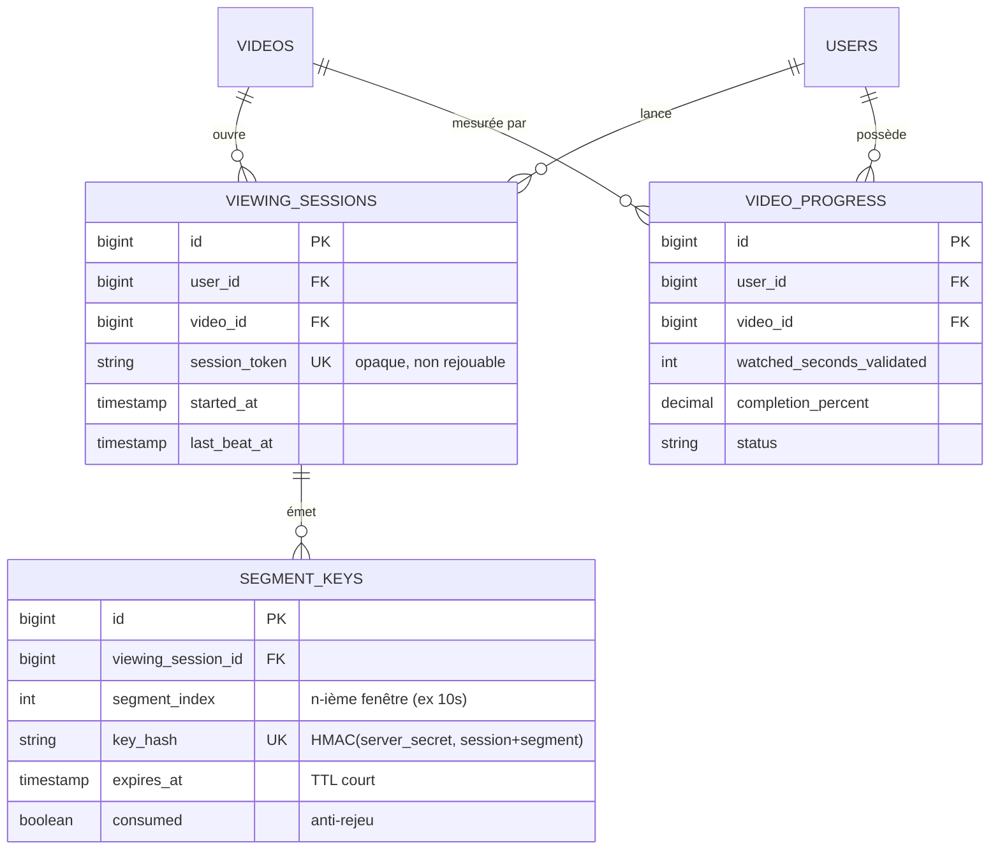
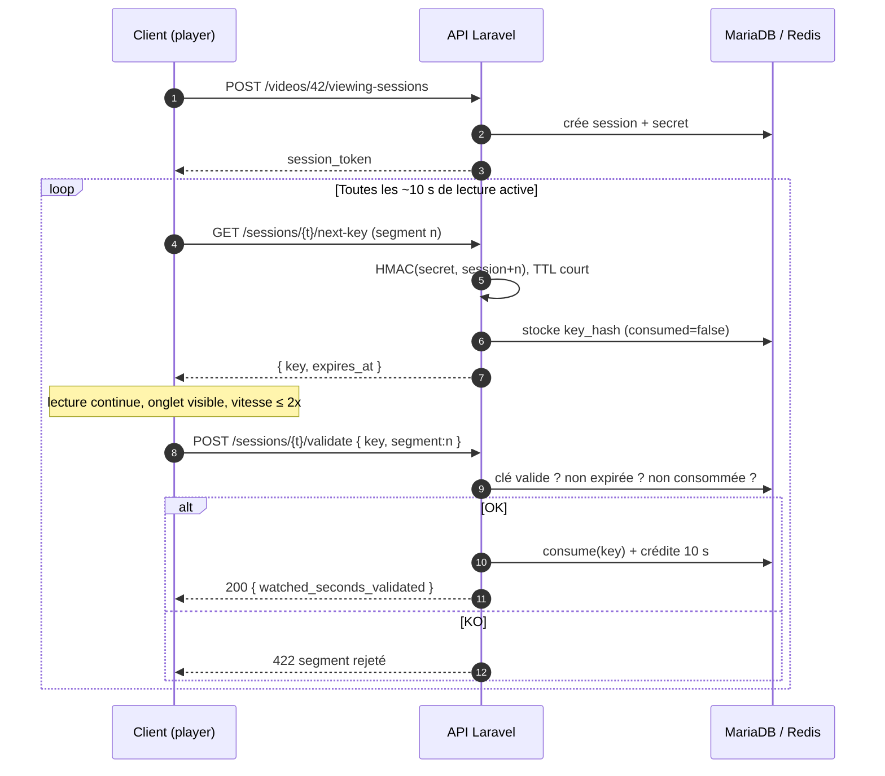
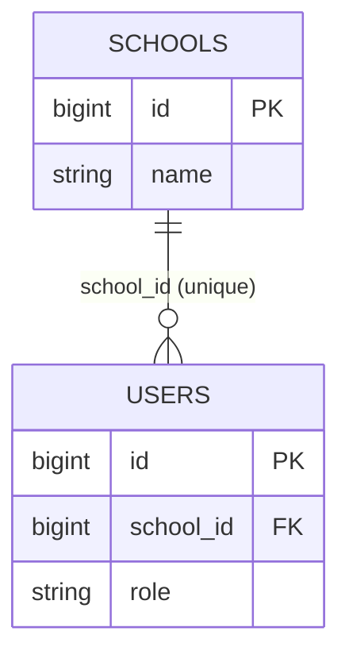
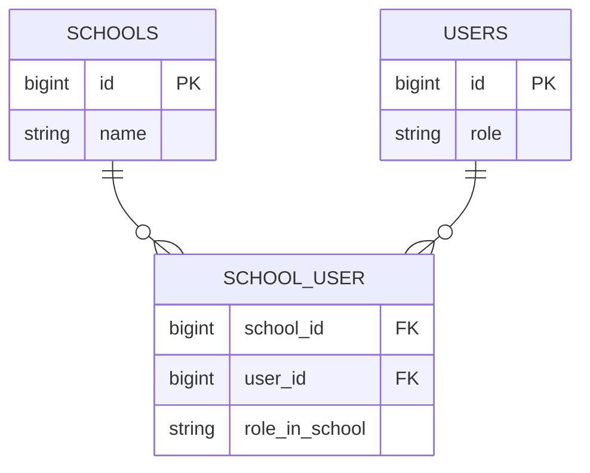
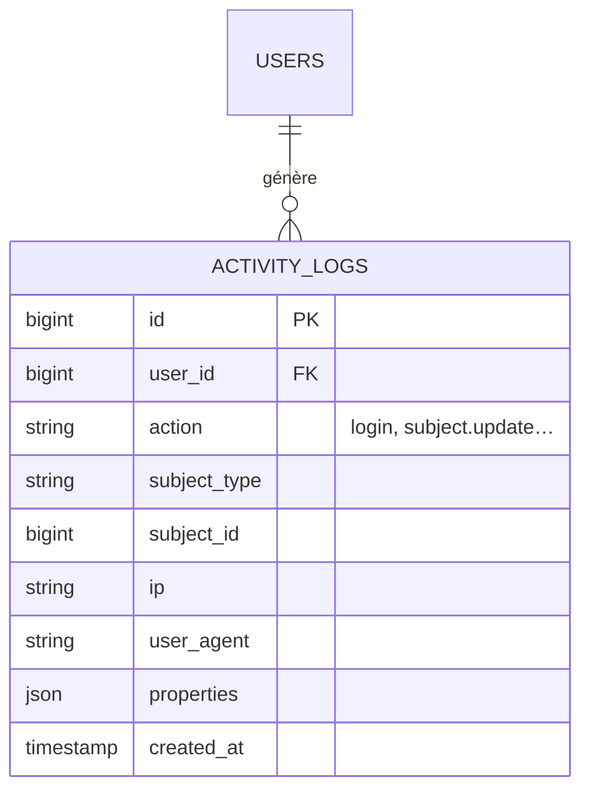
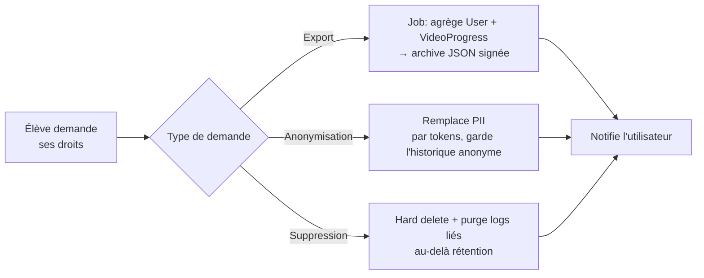

# 🛠️ Backend
<div class="text-base opacity-70 mt-2">Laravel 12 · API Platform · Sanctum · MariaDB / Redis</div>

---
layout: default
---

# Backend — état des lieux

<div class="grid grid-cols-2 gap-8 mt-2">

<div>

### ✅ Déjà en place

- **API Platform** sur 8 modèles (`#[ApiResource]`)
- **Swagger / OpenAPI** exposé (`/api/docs`)
- **Sanctum** — `/auth/login`, tokens Bearer
- **RBAC** — 30+ Gates (`admin`/`teacher`/`student`)
- **Modèle métier** complet + SoftDeletes
- **VideoProgress** — temps, %, statut

</div>

<div>

### 🔲 À construire (cette roadmap)

<div class="flex flex-col gap-2 text-sm">
  <div class="mm-card">#18 · Anti-triche par clés temporelles <span class="mm-chip mm-chip-todo">P-high</span></div>
  <div class="mm-card">#19 · Multi-écoles (relation M-N)</div>
  <div class="mm-card">#20 · Logs d'activité (audit)</div>
  <div class="mm-card">#21 · Conformité RGPD</div>
</div>

</div>

</div>

<!--
Le socle est solide : tout le CRUD métier et l'auth existent. On attaque la valeur différenciante : la certification du temps de visionnage.
-->

---
layout: section
transition: slide-up
---

# #18 · Anti-triche
<div class="text-base opacity-70 mt-2">Validation serveur du temps de visionnage par clés temporelles</div>

---

# Le problème

<div class="grid grid-cols-2 gap-8 mt-4">

<div>

Aujourd'hui, le client poste directement le temps « validé » :

```http {2,3}
POST /api/video_progress
{
  "video": "/api/videos/42",
  "watched_seconds_validated": 3600
}
```

<div class="mm-card mt-4" style="border-color:#f87171">
<b style="color:#f87171">⚠️ Faille</b><br>
Aucune preuve que la vidéo a réellement été regardée. Un simple <code>curl</code> certifie 1 h de visionnage.
</div>

</div>

<div v-click>

### Ce qu'on veut garantir

- ✅ Lecture **active** (onglet au premier plan)
- ✅ Vitesse **≤ 2x**
- ✅ Temps **continu**, non rejouable
- ✅ **Impossible** à simuler sans le serveur

</div>

</div>

---

# #18 · User stories

<div class="flex flex-col gap-3 mt-4 text-sm">

<div class="mm-card" v-click>
<b style="color:#7bd0ff">En tant que</b> serveur,
<b style="color:#7bd0ff">je veux</b> émettre une clé signée par segment de vidéo
<b style="color:#7bd0ff">afin que</b> seul un client ayant réellement atteint ce segment puisse créditer du temps.
</div>

<div class="mm-card" v-click>
<b style="color:#c084fc">En tant que</b> formateur,
<b style="color:#c084fc">je veux</b> que le temps affiché soit certifié
<b style="color:#c084fc">afin de</b> faire confiance aux statistiques de progression.
</div>

<div class="mm-card" v-click>
<b style="color:#34d399">En tant qu'</b>élève honnête,
<b style="color:#34d399">je veux</b> que ma progression se valide en arrière-plan
<b style="color:#34d399">afin de</b> ne pas avoir à interagir pour prouver que je regarde.
</div>

</div>

---

# #18 · MLD / MPD — nouvelles tables



<div class="text-xs opacity-60 text-center mt-1">Le crédit de temps n'est écrit dans <code>VIDEO_PROGRESS</code> que par consommation de clés valides.</div>

---

# #18 · Séquence — émission & validation



---

# #18 · Règles & garde-fous

<div class="grid grid-cols-2 gap-6 mt-4 text-sm">

<div class="mm-card">
<b style="color:#7bd0ff">Anti-rejeu</b><br>
Une clé est <code>consumed</code> à usage unique. Rejouer une clé → 422.
</div>

<div class="mm-card">
<b style="color:#7bd0ff">Anti-fast-forward</b><br>
Les segments doivent être <b>contigus</b> ; un saut d'index invalide la cadence.
</div>

<div class="mm-card">
<b style="color:#7bd0ff">TTL court</b><br>
<code>expires_at</code> ≈ durée du segment ; impossible de batcher les clés.
</div>

<div class="mm-card">
<b style="color:#7bd0ff">Cadence réelle</b><br>
Δt serveur entre deux validations ≥ segment / 2x. Sinon rejet.
</div>

</div>

<div class="text-xs opacity-60 mt-4 text-center">
Implémentation : nouveau <code>State Processor</code> + <code>ApiResource</code> dédiés, secret par session stocké en Redis.
</div>

---
layout: section
transition: slide-up
---

# #19 · Multi-écoles
<div class="text-base opacity-70 mt-2">Un utilisateur rattaché à plusieurs écoles</div>

---

# #19 · Avant / après

<div class="grid grid-cols-2 gap-6 mt-2">

<div>

### Aujourd'hui — 1-N



<div class="mm-card mt-3" style="border-color:#f87171">
Un admin/formateur ne peut gérer <b>qu'une</b> école.
</div>

</div>

<div>

### Cible — M-N



<div class="mm-card mt-3" style="border-color:#34d399">
Pivot <code>school_user</code> + rôle par école.
</div>

</div>

</div>

<div class="text-xs opacity-70 mt-3">
<b>Impact :</b> Gates d'isolation revues (appartenance multi-écoles), <code>/auth/me</code> renvoie la liste des écoles, scoping des endpoints adapté.
</div>

---
layout: two-cols
layoutClass: gap-8
---

# #20 · Logs d'activité

Journal d'audit des actions sensibles : auth, CRUD école/classe/matière, accès contenus.

<div class="mm-card mt-4 text-sm">
<b style="color:#7bd0ff">Pourquoi</b><br>
Traçabilité, sécurité, et pré-requis de la conformité RGPD (#21).
</div>

::right::



<div class="text-xs opacity-60 mt-2">
Endpoint de consultation réservé <code>admin</code>.
</div>

---

# #21 · Conformité RGPD

<div class="grid grid-cols-3 gap-4 mt-2 text-sm">
  <div class="mm-card"><b style="color:#7bd0ff">Anonymisation</b><br>Purge des PII, conservation des stats agrégées.</div>
  <div class="mm-card"><b style="color:#c084fc">Export</b><br>Données personnelles en JSON, sur demande.</div>
  <div class="mm-card"><b style="color:#34d399">Suppression</b><br>Effacement définitif au-delà du soft delete.</div>
</div>



---
layout: default
---

# Backend — récap & dépendances

| Issue | Sujet | Priorité | Débloque |
|-------|-------|----------|----------|
| **#18** | Anti-triche · clés temporelles | 🔴 high | Web #22 · Mobile #25 |
| **#19** | Multi-écoles M-N | 🟡 medium | — |
| **#20** | Logs d'activité | 🟡 medium | #21 |
| **#21** | RGPD | 🟡 medium | — |

<div class="mm-card mt-6" style="border-color:#7bd0ff">
<b style="color:#7bd0ff">Chemin critique :</b> #18 conditionne tout l'anti-triche côté clients. À livrer en premier.
</div>

<!--
Sans #18, web et mobile ne peuvent intégrer que des stubs. C'est la priorité absolue de la roadmap.
-->
