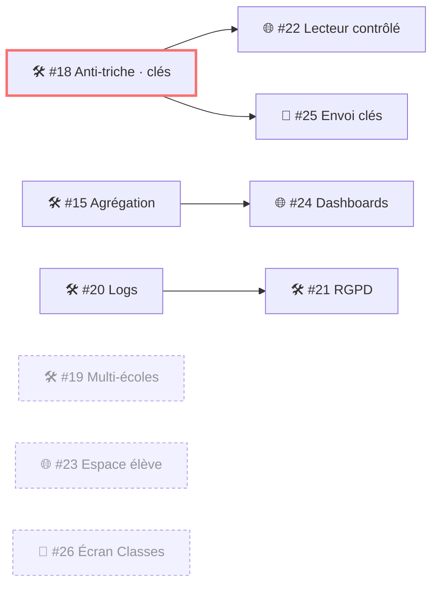

# 🗺️ Roadmap & clôture

---

# Graphe des dépendances

<b style="color:#f87171">#18</b> est le nœud critique : il débloque l'anti-triche web <em>et</em> mobile.

---

# Ordre de bataille

  
<b style="color:#f87171">Lot 1 — Fondation anti-triche</b> · #18 (backend) → puis #22 (web) & #25 (mobile) en parallèle

  
<b style="color:#7bd0ff">Lot 2 — Suivi pédagogique</b> · #15 (agrégation) → #24 (dashboards)

  
<b style="color:#c084fc">Lot 3 — Parcours & confort</b> · #23 (espace élève) · #26 (écran classes)

  
<b style="color:#34d399">Lot 4 — Conformité & multi-tenant</b> · #19 · #20 · #21

9 issues · projet GitHub « MontoMaster Roadmap » · périmètre IA traité dans une session ultérieure.

---
layout: center
class: text-center
---

# Démo — comptes de test

  
Formateur

  <QRCode
    class="mt-3"
    :width="200" :height="200" type="svg"
    data="http://localhost:4200/login?role=teacher"
    :margin="6"
    :dotsOptions="{ type: 'extra-rounded', color: '#c084fc' }"
    :backgroundOptions="{ color: '#ffffff' }"
  />
  
prof@monto.test Prof123!

  
Élève

  <QRCode
    class="mt-3"
    :width="200" :height="200" type="svg"
    data="http://localhost:4200/login?role=student"
    :margin="6"
    :dotsOptions="{ type: 'extra-rounded', color: '#34d399' }"
    :backgroundOptions="{ color: '#ffffff' }"
  />
  
eleve@monto.test Eleve123!

Remplacer <code>localhost:4200</code> par l'URL Vercel le jour de la démo.

---
layout: end
class: text-center
---

# Merci 🙌

Questions / discussion

  Backend #18–21
  Web #22–24
  Mobile #25–26

