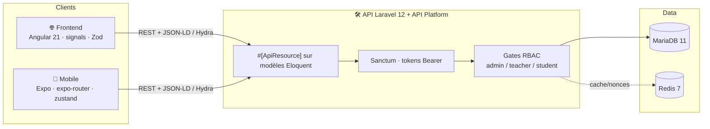
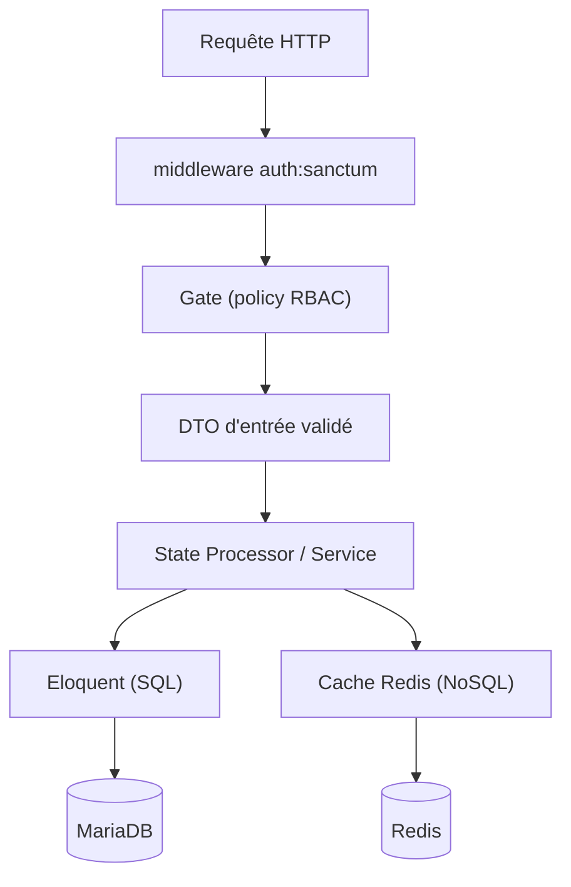
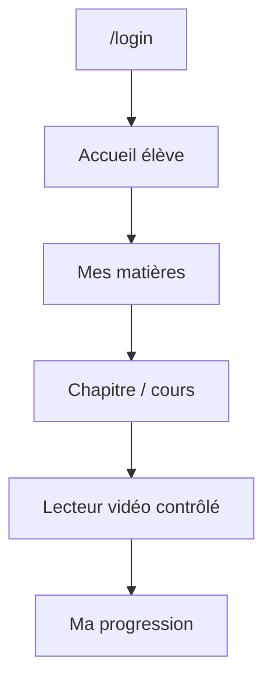
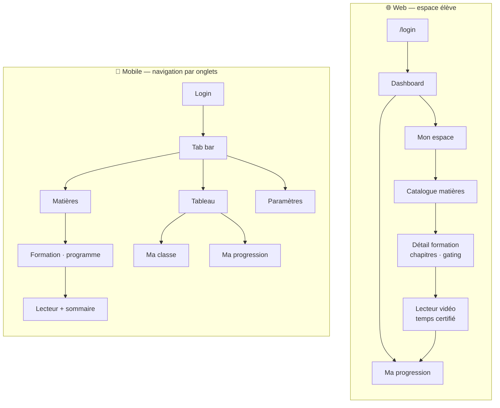
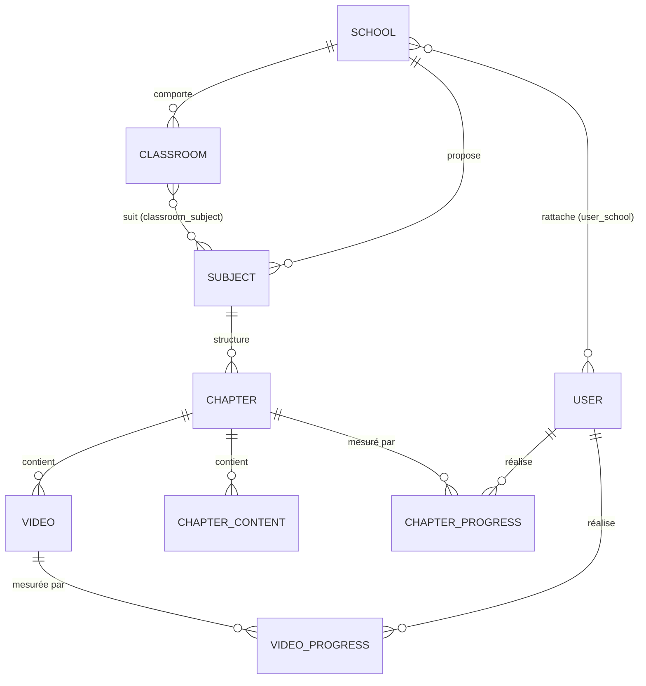
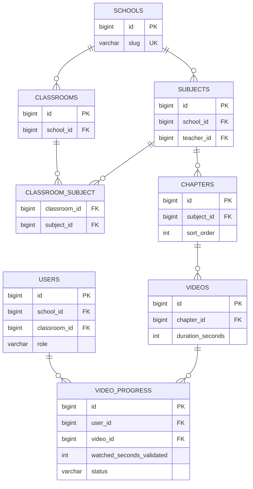
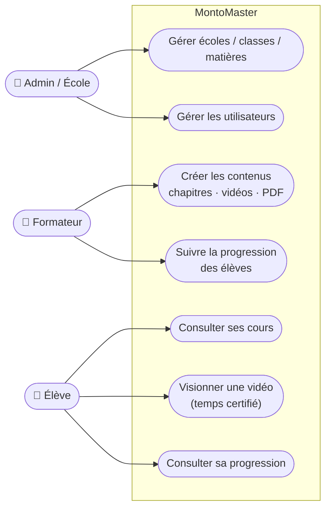
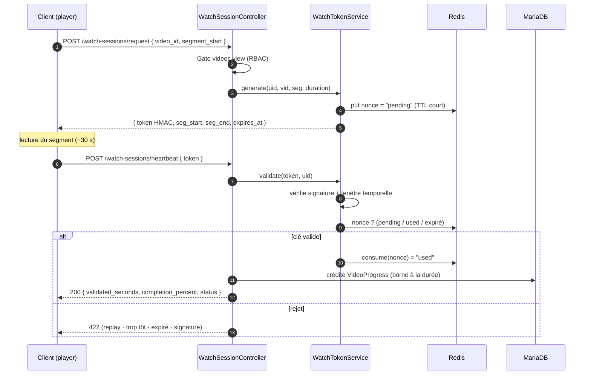

# 2 · Conception

Architecture logicielle · Maquettes · BDD · UML

<!--
Deuxième partie : la conception. On va dérouler les spécifications, l'architecture en couches, les maquettes, puis la modélisation de données et l'UML.
-->

---
layout: default
---

# Spécifications fonctionnelles

### Fonctionnalités clés

  
Authentification & gestion des rôles

  
Gestion multi-écoles · classes · matières

  
Parcours de cours (chapitres → vidéos / PDF)

  
<b style="color:#7bd0ff">Lecture vidéo contrôlée anti-triche</b>

  
Suivi de progression certifié + dashboards

### User stories représentatives

  

  <b style="color:#34d399">En tant qu'</b>élève, je veux que mon temps de visionnage se valide automatiquement quand je regarde vraiment, afin que ma progression soit juste.
  

  

  <b style="color:#c084fc">En tant que</b> formateur, je veux un suivi fiable de mes élèves, afin de m'appuyer sur des statistiques certifiées.
  

<!--
On a formalisé cinq fonctionnalités clés : l'authentification et les rôles, la gestion multi-écoles, les parcours de cours, le cœur du projet — la lecture vidéo contrôlée anti-triche — et le suivi de progression avec ses dashboards. On s'appuie sur des user stories : celle de l'élève qui veut que son temps se valide automatiquement quand il regarde vraiment, et celle du formateur qui veut un suivi fiable. Vous voyez que ces deux stories pointent la même exigence : la fiabilité de la donnée de progression. C'est elle qui justifie tout le dispositif technique qu'on va détailler.
-->

---
layout: center
---

# Architecture logicielle — monorepo, une API

<!--
Voici la vue d'ensemble. Un monorepo, trois applications, mais une seule API. Les deux clients — Angular avec signals et Zod, Expo avec zustand — parlent à l'API Laravel en REST, au format JSON-LD/Hydra produit par API Platform. Particularité qu'on détaillera : l'API est déclarée directement sur les modèles Eloquent via l'attribut ApiResource, sans contrôleurs REST classiques. La requête traverse Sanctum pour l'authentification, puis les Gates RBAC pour l'autorisation, avant d'atteindre MariaDB. Et Redis, à côté, porte l'état éphémère de l'anti-triche — les nonces et le cache. Ce découplage clients/API est ce qui nous a permis de développer le web et le mobile en parallèle sans dupliquer la logique métier.
-->

---

# Architecture en couches — côté API

L'application est organisée en **couches** découplées, du transport vers la persistance :

  
<b style="color:#7bd0ff">Présentation</b> — opérations <code>#[ApiResource]</code> + OpenAPI

  
<b style="color:#c084fc">Validation</b> — DTO d'entrée (<code>*CreateInput</code>)

  
<b style="color:#34d399">Métier</b> — State Processors / Providers, Services

  
<b style="color:#fbbf24">Accès données</b> — modèles Eloquent + Redis

<!--
En zoomant sur l'API, on retrouve une architecture en couches classique mais bien séparée. Couche présentation : les opérations ApiResource, qui génèrent aussi l'OpenAPI. Couche validation : des DTO d'entrée dédiés, découplés du modèle. Couche métier : les State Processors et Providers, et les services. Couche accès données : Eloquent pour le SQL, Redis pour le NoSQL. Le diagramme de droite montre le trajet d'une requête : middleware d'auth, puis Gate, puis DTO validé, puis Processor, puis persistance. Cette séparation est exactement ce que le référentiel attend sous « concevoir et développer une application en couches ».
-->

---

# Maquettes & enchaînement des écrans

### Enchaînement (parcours élève)

### Maquette — suivi (formateur)

┌────────────────────────────┐ 
│ Suivi · Classe 3A   [filtre]│ 
├──────────┬─────────┬────────┤ 
│ Élève    │ Matière │ %      │ 
├──────────┼─────────┼────────┤ 
│ A. Dupont│ Angular │ ▓▓▓▓░ 78│ 
│ B. Martin│ Angular │ ▓▓░░░ 41│ 
│ C. Leroy │ Laravel │ ▓▓▓▓▓ 96│ 
└──────────┴─────────┴────────┘

Les captures des interfaces réelles (web & mobile) sont présentées en section <b>Réalisations</b>.

<!--
Côté maquettes, on a d'abord travaillé l'enchaînement des écrans pour le parcours élève : du login jusqu'à « ma progression », en passant par le catalogue, le chapitre et le lecteur contrôlé. À droite, une maquette du tableau de suivi formateur — la donnée certifiée remontée par classe et par matière. On montre ici la basse-fidélité ; les captures des écrans réels arrivent en partie Réalisations, pour bien distinguer la phase de conception de la phase de réalisation.
-->

---
layout: center
---

# Arborescence & navigation — espace élève

6 écrans côté web · 6 écrans côté mobile — mêmes domaines, navigation adaptée à chaque plateforme.

<!--
Cette arborescence illustre la parité qu'on évoquait. À gauche le web, organisé par routes ; à droite le mobile, organisé par onglets avec Expo Router. Mêmes domaines des deux côtés — dashboard, matières, formation, lecteur, progression — mais une navigation adaptée à chaque plateforme : du routing classique sur le web, une tab bar sur mobile. Six écrans de chaque côté. C'est le même modèle mental pour l'utilisateur, qu'il soit sur navigateur ou sur téléphone.
-->

---
layout: default
---

# Wireframe web — écrans élève

Basse-fidélité · squelette UI : placeholders image ✕, boutons, recherche, navigation — monochrome bleu

  
monto.app/student

  

    
MontoAccueil · Matières · ProgressionL

    

    

    

    
Mes matières

    

      

      

      

      

    

    <button class="wf-b p bl">Voir ma progression →</button>
  

Mon espace · hub élève

  
monto.app/formations

  

    
MontoAccueil · Matières · ProgressionL

    

    
Rechercher une matière…

    
TousDevDesignComm

    

      

<button class="wf-b" style="margin-top:2px">Voir</button>

      

<button class="wf-b" style="margin-top:2px">Voir</button>

    

    
🔒

  

Catalogue · recherche + cartes matières

  
…/formations/12

  

    
‹ Catalogue › Angular 21

    

    

    
12 chapitres47 contenus3 h

    

<i style="width:45%"></i>
45%

    
Chapitre 1 — Fondamentaux ▾

    

6 min

    

9 min

    
🔒

  

Détail formation · programme + gating

<!--
Voici les wireframes basse-fidélité des trois écrans élève côté web : le hub « mon espace », le catalogue avec recherche et filtres par catégorie, et le détail d'une formation. Notez sur ce dernier le verrou — le « gating » : les chapitres se déverrouillent au fur et à mesure, on ne peut pas sauter en avant. C'est la traduction visuelle de l'anti-triche au niveau du parcours. Ces squelettes monochromes nous ont servi à figer la structure avant de coder l'UI.
-->

---
layout: default
---

# Wireframe web — lecteur anti-triche & progression

L'écran signature : visionnage à temps certifié, et son tableau de bord de suivi

  
…/formations/12/47

  

    
‹ Chapitre 1 — Les signals Angular

    

    

<i style="width:62%"></i>
12:30 / 20:00

    
<button class="wf-b" style="flex:1">‹ Précédent</button><button class="wf-b p" style="flex:1">Suivant ›</button>

    

⏱ Temps certifié — anti-triche

heartbeat 30 s · token HMAC · nonce Redis

  

Lecteur vidéo contrôlé · cœur du dispositif

  
monto.app/progression

  

    
MontoAccueil · Matières · ProgressionL

    

    

      

4 h

      

58%

      

3

      

2

    

    

en cours

<i style="width:78%"></i>

    

terminé

<i style="width:96%"></i>

    

à faire

<i style="width:4%"></i>

  

Ma progression · KPI + statut par matière

<!--
Ces deux écrans sont la signature du projet. À gauche, le lecteur vidéo contrôlé : sous la vidéo, un encart « temps certifié » qui matérialise le dispositif — un heartbeat toutes les 30 secondes, un token HMAC, un nonce en Redis. C'est là que se joue l'anti-triche, on détaillera le mécanisme en partie Réalisations. À droite, l'écran « ma progression » : des KPI en haut — temps, pourcentage, formations en cours et terminées — puis le statut par matière. L'enjeu de conception ici était de rendre lisible une donnée qui, derrière, est garantie côté serveur.
-->

---
layout: default
---

# Wireframe mobile — écrans élève

Format mobile (393×852) · navigation par onglets (Expo Router) — mêmes domaines que le web

  
<i></i>

  

    

    

    <button class="wf-b p bl">Parcourir les matières</button>
    

      

      

    

  

  

Tableau

Matières

Param.

Dashboard

  
<i></i>

  

    

    
Rechercher…

    

    

    
🔒

  

  

Tableau

Matières

Param.

Matières

  
<i></i>

  

    
‹ retour

    

    

    
58%4 chap.

    

    
🔒

  

Programme

  
<i></i>

  

    
‹ retour

    

    

<i style="width:62%"></i>
62%

    

⏱ Temps certifié

    <button class="wf-b bl">Sommaire ▾</button>
  

Lecteur + sommaire

<!--
Et les mêmes écrans côté mobile, au format 393×852, en navigation par onglets. Vous retrouvez le dashboard, les matières avec recherche, le programme d'une formation avec son gating, et le lecteur avec son sommaire et son temps certifié. On insiste : ce ne sont pas deux conceptions distinctes, c'est la même pensée déclinée sur deux supports — ce qui réduit fortement le coût de maintenance.
-->

---
layout: center
---

# Modèle conceptuel de données (MCD)

<!--
Le modèle conceptuel. La hiérarchie descend d'école vers classe et matière, puis matière → chapitre → vidéos et contenus. Deux associations many-to-many qu'on souligne : un utilisateur peut être rattaché à plusieurs écoles — via user_school — et une classe suit plusieurs matières — via classroom_subject. Enfin la progression est mesurée à deux niveaux : video_progress par vidéo, et chapter_progress par chapitre. On peut mentionner ici un point de modélisation qu'on a identifié et tracé dans la roadmap : le contenu réellement affiché aux élèves est un ChapterContent, alors que la progression est indexée sur Video — relier proprement les deux est le prochain chantier backend.
-->

---
layout: center
---

# Modèle physique de données (MPD)

<!--
Le passage au modèle physique. Les clés primaires en bigint auto-incrémentées, les clés étrangères matérialisées — school_id, classroom_id, teacher_id — et des contraintes qu'on a posées explicitement : un slug unique sur les écoles, un index unique composite sur l'ordre des chapitres. On veut attirer l'attention sur video_progress : la colonne watched_seconds_validated, c'est le temps validé côté serveur — le mot « validated » est important, il dit que cette valeur n'est jamais acceptée telle quelle depuis le client. Les SoftDeletes sont actifs sur les entités métier pour ne jamais perdre l'historique.
-->

---
layout: center
---

# Cas d'utilisation

<!--
Le diagramme de cas d'utilisation synthétise qui fait quoi. L'admin et l'école gèrent la structure et les utilisateurs ; le formateur crée les contenus et suit la progression de ses élèves ; l'élève consulte ses cours, visionne en temps certifié et consulte sa progression. Chaque cas se traduit, dans le code, par une opération ApiResource protégée par une Gate. Le cas le plus significatif — celui qu'on détaille juste après — est « visionner une vidéo en temps certifié », car c'est lui qui porte toute la logique anti-fraude.
-->

---
layout: center
---

# Séquence — cas le plus significatif (anti-triche)

<!--
Voici le diagramme de séquence du cas anti-triche, à lire pas à pas. Premier temps : le client demande une session de visionnage pour un segment ; le serveur vérifie d'abord la Gate videos.view, puis génère un token via le WatchTokenService et dépose un nonce « en attente » dans Redis avec un TTL court. Le client reçoit un token signé HMAC, borné dans le temps. Deuxième temps : après environ 30 secondes de lecture, le client renvoie le token en heartbeat. Le serveur valide la signature, vérifie la fenêtre temporelle, et consulte l'état du nonce. Si la clé est valide, il consomme le nonce — passage à « used » — et crédite le temps dans VideoProgress, borné à la durée réelle de la vidéo. Sinon, 422 : que ce soit un rejeu, une soumission trop tôt, une clé expirée ou une signature altérée. C'est la pièce maîtresse de notre conception, et on va maintenant montrer comment elle est implémentée. On passe aux réalisations.
-->

