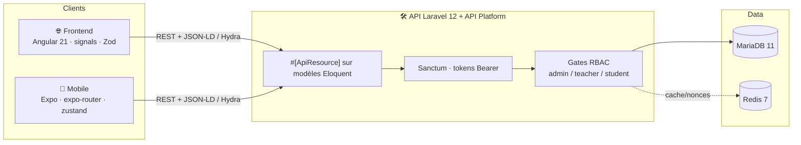
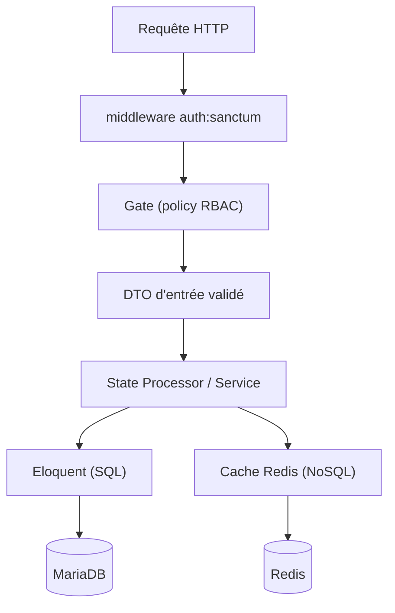
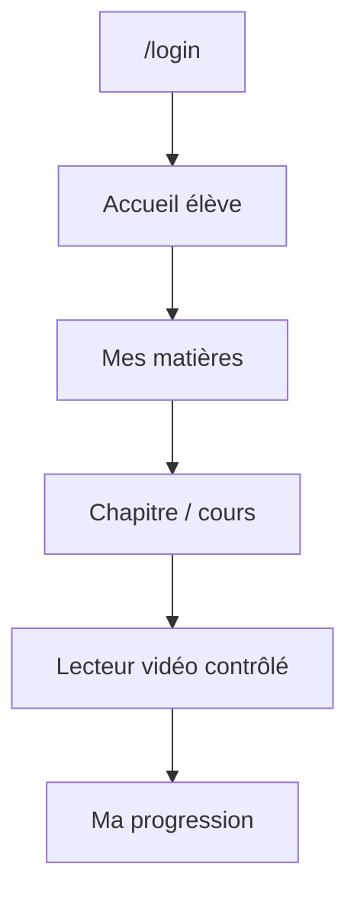
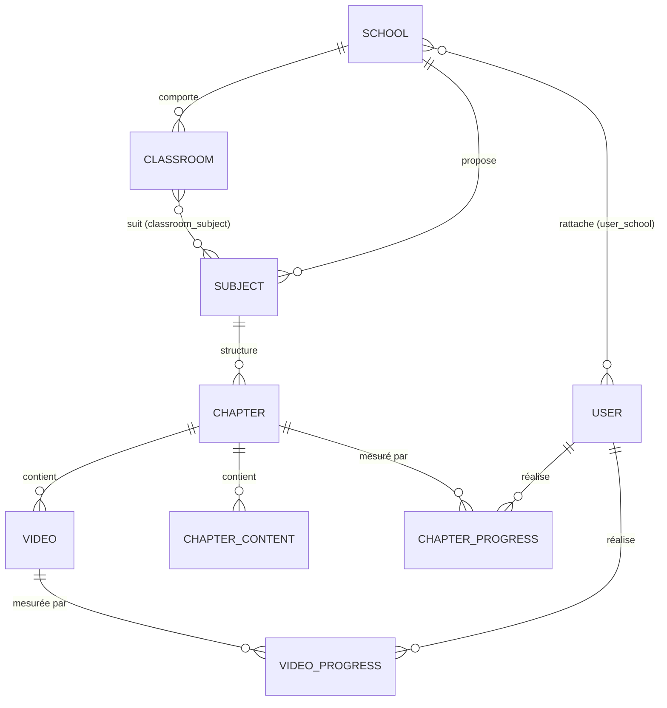
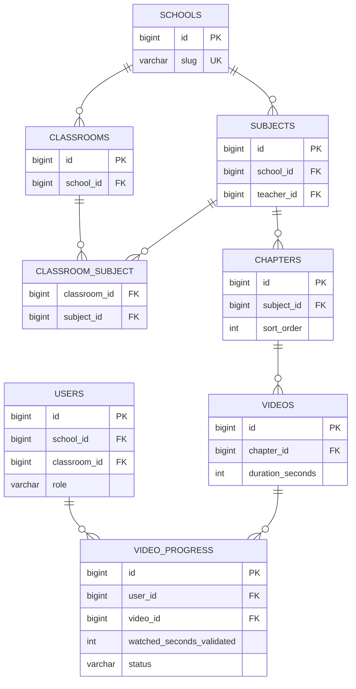
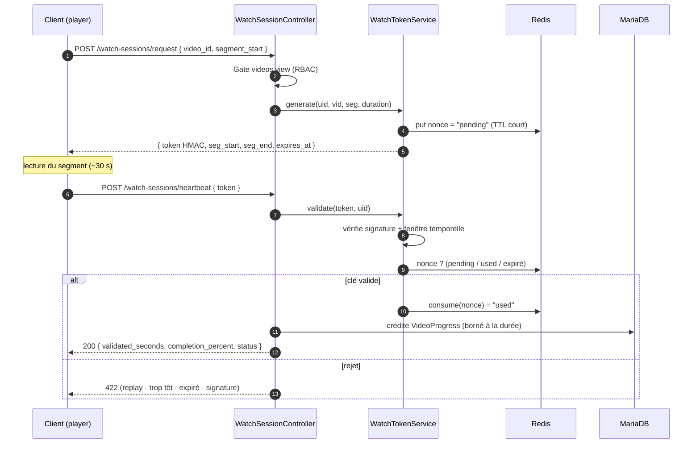

# 2 · Conception

Architecture logicielle · Maquettes · BDD · UML

---
layout: default
---

# Spécifications fonctionnelles

### Fonctionnalités clés

  
Authentification & gestion des rôles

  
Gestion multi-écoles · classes · matières

  
Parcours de cours (chapitres → vidéos / PDF)

  
<b style="color:#7bd0ff">Lecture vidéo contrôlée anti-triche</b>

  
Suivi de progression certifié + dashboards

### User stories représentatives

  

  <b style="color:#34d399">En tant qu'</b>élève, je veux que mon temps de visionnage se valide automatiquement quand je regarde vraiment, afin que ma progression soit juste.
  

  

  <b style="color:#c084fc">En tant que</b> formateur, je veux un suivi fiable de mes élèves, afin de m'appuyer sur des statistiques certifiées.
  

---
layout: center
---

# Architecture logicielle — monorepo, une API

---

# Architecture en couches — côté API

L'application est organisée en **couches** découplées, du transport vers la persistance :

  
<b style="color:#7bd0ff">Présentation</b> — opérations <code>#[ApiResource]</code> + OpenAPI

  
<b style="color:#c084fc">Validation</b> — DTO d'entrée (<code>*CreateInput</code>)

  
<b style="color:#34d399">Métier</b> — State Processors / Providers, Services

  
<b style="color:#fbbf24">Accès données</b> — modèles Eloquent + Redis

---

# Maquettes & enchaînement des écrans

### Enchaînement (parcours élève)

### Maquette — suivi (formateur)

┌────────────────────────────┐ 
│ Suivi · Classe 3A   [filtre]│ 
├──────────┬─────────┬────────┤ 
│ Élève    │ Matière │ %      │ 
├──────────┼─────────┼────────┤ 
│ A. Dupont│ Angular │ ▓▓▓▓░ 78│ 
│ B. Martin│ Angular │ ▓▓░░░ 41│ 
│ C. Leroy │ Laravel │ ▓▓▓▓▓ 96│ 
└──────────┴─────────┴────────┘

Les captures des interfaces réelles (web & mobile) sont présentées en section <b>Réalisations</b>.

---
layout: center
---

# Modèle conceptuel de données (MCD)

---
layout: center
---

# Modèle physique de données (MPD)

---
layout: center
---

# Cas d'utilisation

---
layout: center
---

# Séquence — cas le plus significatif (anti-triche)

