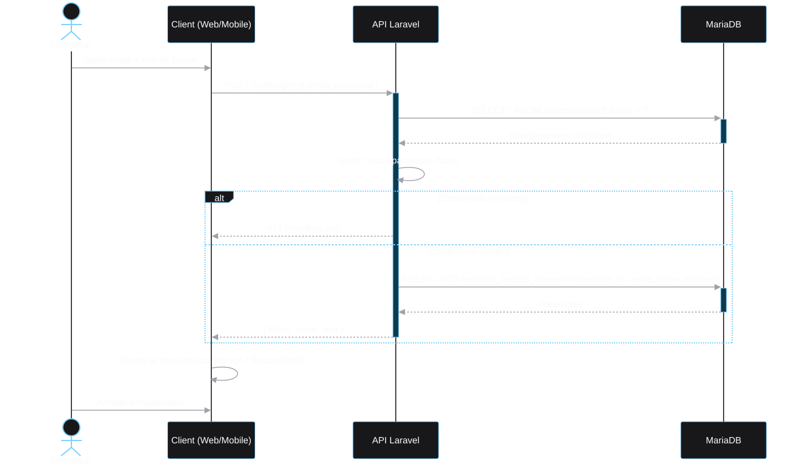
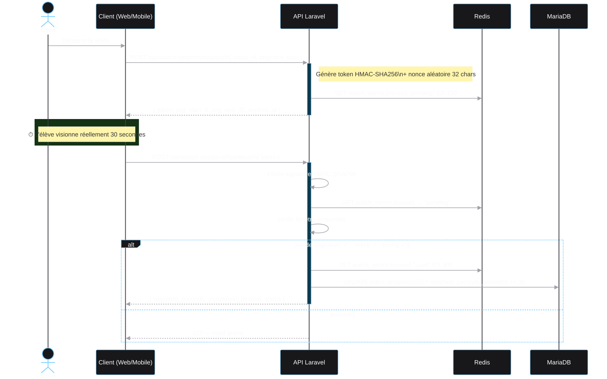

# 2 · Conception

Architecture · MCD · Classes · Cas d'utilisation · Séquence · Maquettes

<!--
**[CONCEPTION]** Les décisions d'architecture prises avant tout développement.

- On couvre : stack, MCD, classes, cas d'utilisation, séquences, maquettes

→ Ce sont ces choix qui conditionnent la qualité de tout le code.
-->

---
layout: default
---

# Architecture globale

<b style="color:#7bd0ff">Backend</b> 
Laravel 12 · API Platform 4 
MariaDB · Redis · Sanctum 
→ API REST + doc OpenAPI auto

<b style="color:#c084fc">Frontend Web</b> 
Angular 21 · Zod · TailwindCSS 
→ SPA consomme l'API

<b style="color:#34d399">Mobile</b> 
Expo / React Native 
expo-video · expo-secure-store 
→ même API, même logique

<b>Monorepo GitHub</b> — un seul dépôt, trois projets, un Docker Compose. API Platform génère la documentation OpenAPI automatiquement.

<!--
**[ARCHITECTURE]** Trois couches indépendantes, une seule API partagée.

- **Laravel + API Platform** : CRUD + doc Swagger générés automatiquement
- **Angular** : SPA web, typage TypeScript strict
- **Expo** : iOS et Android depuis une seule base React Native
- **Redis** : nonces anti-triche avec TTL — hors base relationnelle

→ Un seul dépôt, un seul `docker compose up`.
-->

---
layout: default
---

# MCD — Modèle Conceptuel de Données

Entités : rectangles · Cardinalités sur les liens · MCD = modèle métier pur, sans FK ni types SQL

<!--
**[MCD]** Modèle métier pur — entités et associations sans SQL.

- Hiérarchie linéaire : **School → Classroom → Subject → Chapter → Video**
- Relation N-N `classroom_subject` : une matière dans plusieurs classes
- Relation N-N `user_school` : un formateur dans plusieurs établissements
- `VideoProgress` : relie un élève à une vidéo, une ligne par vidéo visitée

→ Le MPD ajoute ensuite les FK, index et types SQL.
-->

---
layout: default
---

# Diagramme de classes

  
◆ <b>Composition</b> — l'enfant ne vit pas sans le parent

  
◇ <b>Agrégation</b> — l'enfant peut exister seul

  
→ <b>Association</b> — entités indépendantes reliées

<!--
**[CLASSES]** Le MCD traduit en structure orientée objet.

- **Composition** (losange plein) : `Classroom` ne vit pas sans `School` → SoftDeletes
- **Agrégation** (losange vide) : une matière peut exister sans classe → pivot `classroom_subject`
- **Association** (flèche) : `VideoProgress` relie élève et vidéo, entité indépendante

→ Chaque relation se retrouve directement dans le code Eloquent.
-->

---
layout: default
---

# Diagramme de cas d'utilisation

<!--
**[CAS D'UTILISATION]** Qui fait quoi — sans entrer dans le comment.

- Trois acteurs : **Admin**, **Formateur**, **Élève**
- Lien `«include»` : dépendance obligatoire — visionner inclut toujours s'authentifier
- Visionner inclut aussi l'obtention d'un **token heartbeat** — l'anti-triche est automatique
- `«extend»` aurait été pour des fonctions optionnelles (ex. bannière hors-ligne)

→ Ces cas d'utilisation cadrent exactement les séquences qui suivent.
-->

---
layout: default
---

# Diagramme de séquence — Authentification

<!--
**[SÉQUENCE AUTH]** Scénario commun à tous les rôles — l'authentification.

- **Flèche pleine** : message synchrone, le client attend la réponse
- Mot de passe vérifié par **hash bcrypt** — jamais en clair en base
- Token **Sanctum** inséré dans `personal_access_tokens`, retourné au client
- Stockage : `localStorage` côté web, `SecureStore` côté mobile
- Fragment `alt/else` : credentials invalides → **401**, valides → **200**

→ Le token sert ensuite de clé pour toutes les routes protégées.
-->

---
layout: default
---

# Diagramme de séquence — Heartbeat anti-triche

<!--
**[HEARTBEAT]** Protocole en 3 temps — impossible de tricher sans regarder vraiment.

**Temps 1 — avant de regarder**
- Client → `POST /watch-sessions/request` avec `video_id` + `segment_start`
- Serveur génère un token signé **HMAC-SHA256** : contient user, vidéo, bornes [0–30s], timestamp
- Un **nonce** aléatoire est stocké dans Redis — TTL 150s — il ne servira qu'une seule fois

**Temps 2 — 30 secondes s'écoulent réellement**
- Le serveur ne fait rien — l'horloge murale tourne
- Même en pause, même en seek, le temps réel s'écoule côté serveur

**Temps 3 — le client envoie le heartbeat**
- Serveur vérifie dans l'ordre :
  1. **Signature HMAC** — token falsifié → 422
  2. **Nonce Redis** — déjà utilisé → 422 "replay détecté"
  3. **Fenêtre temporelle** — envoyé trop tôt (< 25s) ou trop tard (> 90s) → 422
- Si tout passe : nonce → `"used"`, `watched_seconds_validated += 30`

→ Le seul moyen de valider un segment : obtenir un token ET attendre le temps réel.
-->

---
layout: default
---

# Maquettes & UserFlow

<b style="color:#f87171">Admin</b> 
Dashboard → gestion écoles → classes → utilisateurs → matières

<b style="color:#c084fc">Formateur</b> 
Mes matières → dépôt vidéo → suivi élèves par matière

<b style="color:#34d399">Élève</b> 
Mes formations → chapitre → lecteur vidéo → progression

<b>Principes UX :</b> navigation linéaire pour l'élève, vitesse vidéo verrouillée à 1x sur mobile, progression visible à chaque niveau de la hiérarchie.

<!--
**[MAQUETTES]** Userflows validés avant tout développement — trois parcours.

- **Admin** : configure la structure école → classes → utilisateurs
- **Formateur** : dépose les vidéos, consulte la progression via vue agrégée
- **Élève** : parcours linéaire, vitesse verrouillée à **1x**, navigation prev/next
- Apprentissage clé : la vue formateur a révélé le besoin d'un **endpoint agrégé dédié**

→ Les maquettes ont influencé le schéma de BDD dès la conception.
-->
