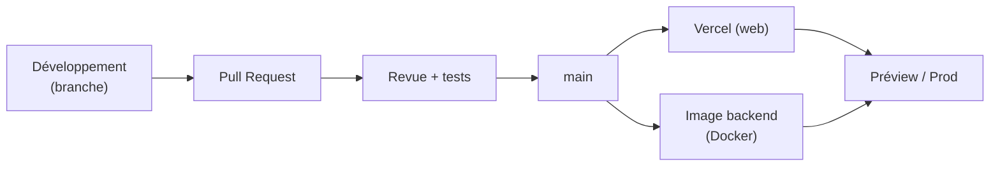

# 5 · Déploiement & DevOps

Préparer, documenter et mettre en production

---
layout: default
---

# Préparer & documenter le déploiement

### Backend — conteneurs

- Stack décrite dans `docker-compose.yml` (nginx · php · mariadb · redis)
- Migrations & seeders versionnés (`artisan migrate` / `db:seed`)
- Configuration par `.env` (clés, BDD, Redis)

### Frontend — Vercel

- `vercel.json` : install **pnpm**, build, **rewrite SPA** → `index.html`
- Sortie : `dist/Angular-Seira/browser`
- Variables `NG_APP_*` définies dans Vercel

### Documentation livrée

  
<code>CLAUDE.md</code> — architecture & commandes

  
<code>SCHEMA_BDD.md</code> — source de vérité du modèle

  
<code>TODO.md</code> — suivi d'avancement vérifié

  
<code>/api/docs</code> — contrat OpenAPI auto

Comptes de seed documentés pour démo : <code>admin</code> / <code>prof</code> / <code>eleve</code> @monto.test.

---
layout: default
---

# Démarche DevOps

### Mise en production

  
<b style="color:#7bd0ff">Déploiement continu</b> Push sur GitHub → build & déploiement automatique sur Vercel (preview par branche, prod sur la principale).

  
<b style="color:#c084fc">Parité des environnements</b> Docker reproduit la stack en local comme en intégration.

  
<b style="color:#34d399">Intégration par PR</b> Une branche par lot, revue puis fusion.

Piste d'amélioration : ajouter une <b>CI</b> (GitHub Actions) exécutant la suite de tests à chaque PR.

