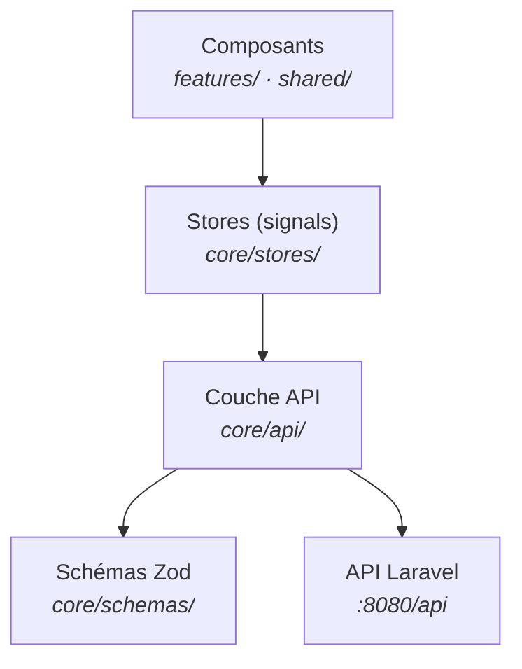

# Focus frontend — Angular 21
<div class="text-base opacity-70 mt-2">Architecture en couches · Signals · Validation Zod · Guards</div>

<!--
**[FRONTEND]** Zoom sur le client web Angular — comment il est structuré.

- Quatre points : l'architecture en couches, les stores signals, la validation Zod, le routing sécurisé
-->

---
layout: default
---

# Architecture en couches — composant → store → API

<div class="grid grid-cols-2 gap-8 mt-2">

<div>



</div>

<div class="text-sm flex flex-col gap-2 mt-2">

<div class="mm-card"><b style="color:#c084fc">Composants</b> — standalone, lazy-loadés, consomment <b>uniquement</b> les stores. Zéro <code>fetch</code> dans les vues.</div>
<div class="mm-card"><b style="color:#7bd0ff">Stores</b> — un par domaine (auth, formation, progress…). Seule couche qui sait <b>d'où vient</b> la donnée.</div>
<div class="mm-card"><b style="color:#34d399">API layer</b> — un fichier par domaine, retourne des observables <b>validés par Zod</b>.</div>

<div class="text-xs opacity-60">
Changer un endpoint = un seul fichier à toucher.
</div>

</div>

</div>

<!--
**[COUCHES]** Provenance des données centralisée — le mandat d'architecture du projet.

- **Composants** : standalone, lazy, ne parlent qu'aux stores — jamais à HTTP directement
- **Stores** : un par domaine, seule couche qui connaît la source de la donnée
- **API layer** : un fichier par domaine, chaque réponse validée par Zod
- Conséquence : changer un endpoint = un seul fichier à modifier

→ Voyons comment un store fonctionne avec les signals.
-->

---

# Stores — services Angular à base de signals

<div class="grid grid-cols-2 gap-6 mt-2">

<div>

```ts {all|1-2|4-7|9-12}
@Injectable({ providedIn: 'root' })
export class FormationStore {
  private readonly api = inject(FormationApi);
  // état privé, mutable seulement ici
  private readonly _items =
    signal<readonly Formation[]>([]);
  private readonly _status = signal<Status>('idle');

  // exposition en lecture seule + dérivés
  readonly items = this._items.asReadonly();
  readonly isLoading =
    computed(() => this._status() === 'loading');
}
```

</div>

<div class="text-sm flex flex-col gap-2 mt-2">

<div class="mm-card"><b style="color:#c084fc">Signal privé / lecture publique</b><br>Seul le store mute son état — les composants lisent <code>asReadonly()</code>.</div>
<div class="mm-card"><b style="color:#7bd0ff">État dérivé</b> — <code>computed()</code> recalcule automatiquement (<code>isLoading</code>, <code>byId</code>…).</div>
<div class="mm-card"><b style="color:#34d399">Réactivité fine</b><br>Le template ne se re-rend que si le signal lu change — pas de zone.js à grande échelle.</div>

</div>

</div>

<!--
**[SIGNALS]** Le store encapsule l'état — pattern uniforme sur tous les domaines.

- **Signal privé** `_items`, exposition publique `asReadonly()` : impossible de muter depuis un composant
- **`computed()`** : état dérivé recalculé automatiquement, jamais désynchronisé
- Réactivité fine : seuls les templates qui lisent le signal se re-rendent
- Côté mobile, le même découpage existe en **zustand** — parité de structure

→ La donnée qui entre dans le store est déjà validée — c'est le rôle de la couche API.
-->

---

# Couche API — observables validés par Zod

<div class="grid grid-cols-2 gap-6 mt-2">

<div>

```ts {all|1-6|8-12}
// parse-response.ts — opérateur RxJS réutilisé partout
export function parseHydraCollection<T>(
  itemSchema: ZodType<T>,
): OperatorFunction<unknown, T[]> {
  return map((r) =>
    withHydraCollection(itemSchema).parse(r).member);
}

// formation.api.ts — un fichier par domaine
getFormations(): Observable<Formation[]> {
  return this.http.get(`${this.base}/subjects`)
    .pipe(parseHydraCollection(FormationSchema));
}
```

</div>

<div class="text-sm flex flex-col gap-2 mt-2">

<div class="mm-card"><b style="color:#34d399">Contrat vérifié à l'exécution</b><br>Toute réponse API passe par un schéma Zod — une dérive du backend casse <b>tôt et explicitement</b>.</div>
<div class="mm-card"><b style="color:#7bd0ff">Hydra / JSON-LD déballé</b><br>L'opérateur extrait <code>member</code> et gère l'enveloppe <code>&lbrace; data &rbrace;</code> — les stores reçoivent des objets propres.</div>
<div class="mm-card"><b style="color:#c084fc">IRI → ids</b> — <code>utils/iri.ts</code> traduit les <code>/api/users/1</code> de l'API.</div>

</div>

</div>

<!--
**[ZOD]** TypeScript ne protège qu'à la compilation — Zod vérifie le contrat à l'exécution.

- **Chaque** réponse API passe par un schéma : champ manquant = erreur immédiate et localisée
- L'opérateur `parseHydraCollection` déballe le JSON-LD Hydra (champ `member`)
- Les IRI (`/api/users/1`) sont traduits en ids par `utils/iri.ts`
- Même mécanisme côté mobile, en fonction pure plutôt qu'en opérateur RxJS

→ Reste à sécuriser l'accès aux écrans : routing et intercepteurs.
-->

---

# Routing lazy & sécurité côté client

<div class="grid grid-cols-2 gap-6 mt-2">

<div>

```ts {all|1-5|7-11}
// app.routes.ts — lazy + rôles
{
  path: 'student',
  ...requireRoles('student'),
  loadComponent: () => import('./features/...'),
}

// auth-error.interceptor.ts — 401 global
export const authErrorInterceptor:
  HttpInterceptorFn = (req, next) => { /* …
  401 → clearSession() + redirect /login */ };
```

</div>

<div class="text-sm flex flex-col gap-2 mt-2">

<div class="mm-card"><b style="color:#c084fc">Lazy loading</b> — chaque page en <code>loadComponent</code> : bundle initial minimal.</div>
<div class="mm-card"><b style="color:#7bd0ff">Guards</b> — <code>authGuard</code> + <code>requireRoles()</code> : espaces admin / teacher / student séparés.</div>
<div class="mm-card"><b style="color:#34d399">Intercepteurs</b> — <code>jwtInterceptor</code> ajoute le Bearer, <code>authErrorInterceptor</code> gère les 401 en un seul endroit.</div>

<div class="mm-card text-xs" style="border-color:#fbbf24">
Le client filtre l'<b>affichage</b> — l'autorisation réelle reste les Gates serveur.
</div>

</div>

</div>

<!--
**[ROUTING]** Confort et cohérence côté client — la vraie sécurité reste serveur.

- **Lazy loading** systématique : le bundle initial ne charge que le nécessaire
- **Guards** : `authGuard` (connecté ?) + `requireRoles()` (bon rôle ?) — trois espaces séparés
- **Intercepteurs** : Bearer ajouté partout, 401 géré en un seul endroit → session vidée + /login
- Honnêteté : ces guards filtrent l'affichage — l'autorisation réelle, ce sont les Gates RBAC

→ Tout ce comportement est couvert par les tests Vitest qu'on voit en partie 4.
-->
