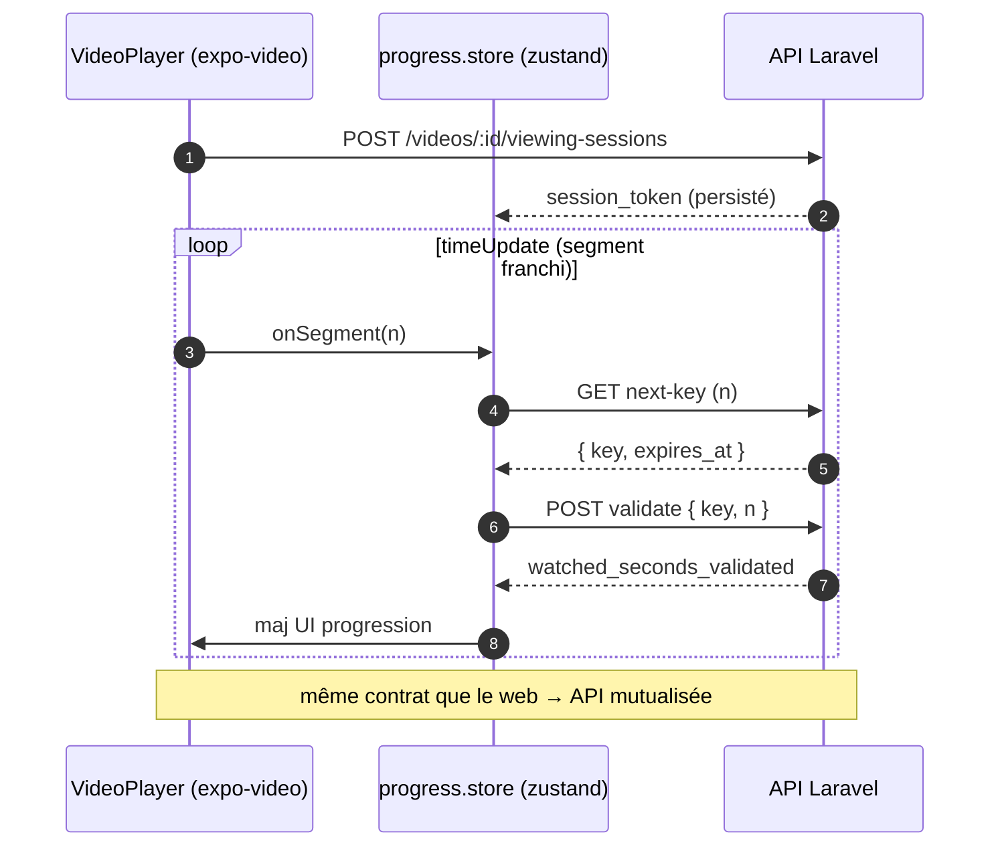
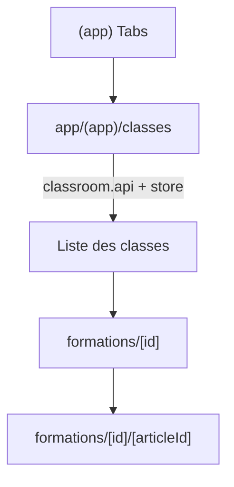

# 📱 App Mobile

Expo · expo-router · zustand · uniwind

---

# Mobile — état des lieux

### ✅ Déjà en place

- **Auth Sanctum** + `expo-secure-store`
- **RoleGate** / `use-role-guard`
- Parcours matières → cours → vidéos
- **VideoPlayer** (`expo-video`) avancé :
  - lecture active (`isPlaying`)
  - vitesse **verrouillée à 1x**
  - anti-seek

### 🔲 À construire

  
#25 · Anti-triche : <b>envoi</b> des clés au serveur P-high

  
#26 · Écran <b>Classes</b> (parcours complet)

Le lecteur mobile est déjà plus strict que le web : il ne manque que la <b>remontée serveur</b>.

---
layout: section
transition: slide-up
---

# #25 · Anti-triche mobile

Brancher le lecteur existant sur les clés serveur

---

# #25 · Déjà fait vs manquant

<b style="color:#34d399">✅ Déjà géré côté client</b>
<ul class="text-sm mt-2">
<li><code>currentTime</code> capté (<code>timeUpdate</code>, 0.5s)</li>
<li>Lecture active détectée</li>
<li>Vitesse verrouillée 1x · anti-seek</li>
</ul>

<b style="color:#fbbf24">🔲 Manquant</b>
<ul class="text-sm mt-2">
<li>Aucun envoi au serveur</li>
<li>Pas de store de progression</li>
<li>Réception / renvoi des clés segment</li>
<li>Edge case : plein écran natif</li>
</ul>

<b style="color:#7bd0ff">En tant qu'</b>élève mobile, <b>je veux</b> que mon visionnage compte comme sur le web, <b>afin d'</b>avoir une progression unifiée.

---

# #25 · Séquence mobile

---
layout: two-cols
layoutClass: gap-8
---

# #26 · Écran Classes

Le parcours matières → cours → vidéos fonctionne, mais l'écran **Classes** manque : `classroom.api.ts` existe mais n'est pas branché.

<b style="color:#7bd0ff">User story</b> 
En tant qu'élève, je veux choisir ma classe puis accéder à ses matières.

::right::

Nouvel écran expo-router + store dédié, garde <code>RoleGate('student')</code>.

---

# Mobile — récap & dépendances

| Issue | Sujet | Dépend de |
|-------|-------|-----------|
| **#25** | Anti-triche · envoi des clés | Backend **#18** |
| **#26** | Écran Classes | — |

<b style="color:#34d399">Avantage :</b> contrat d'API identique au web → l'effort #25 est surtout du <b>branchement store ↔ API</b>, la logique de lecture étant déjà là.

