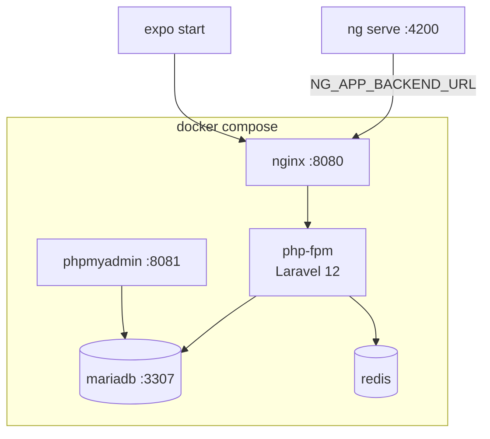
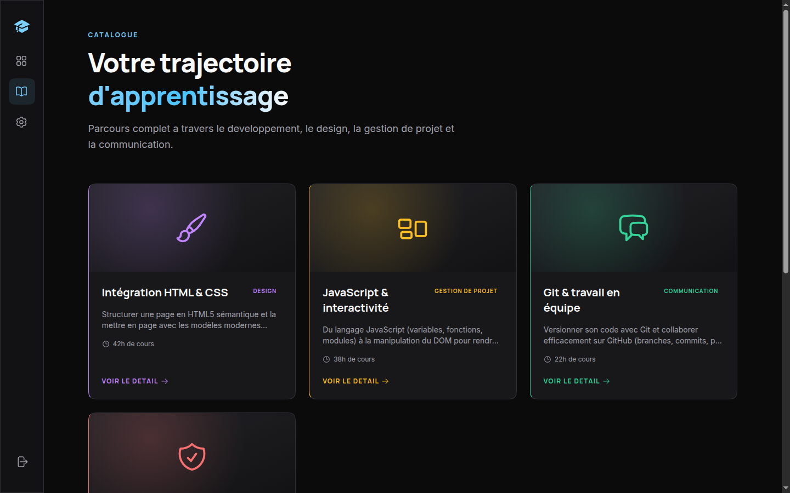
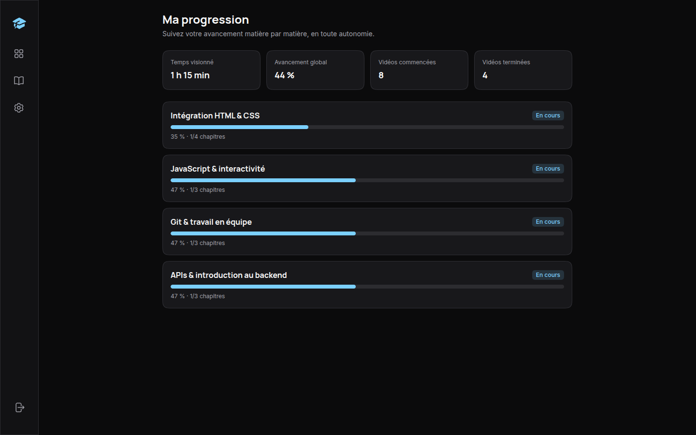
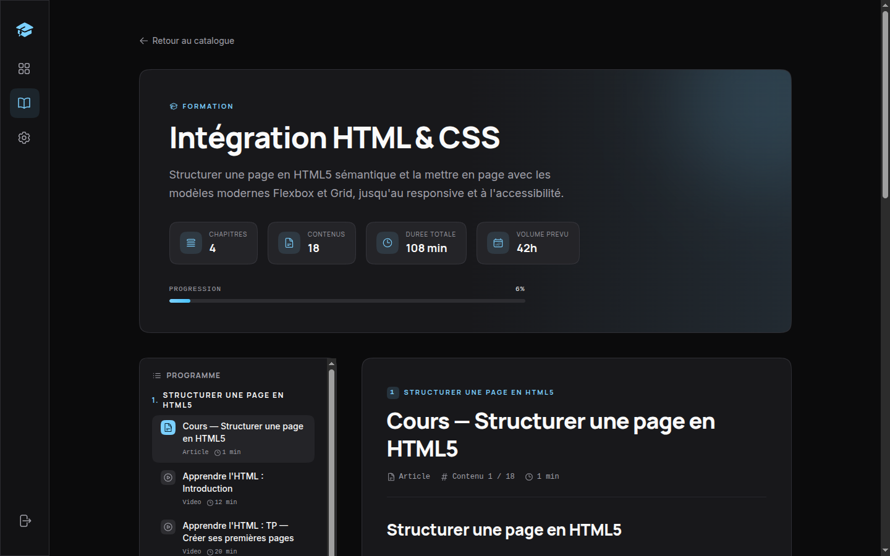
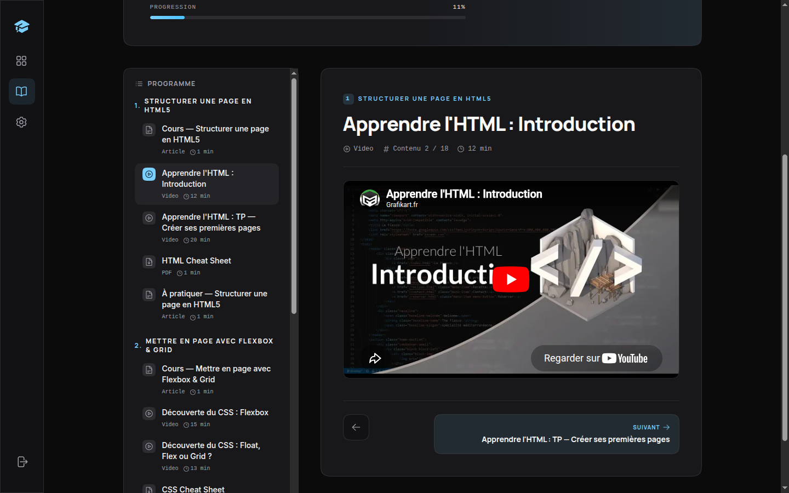
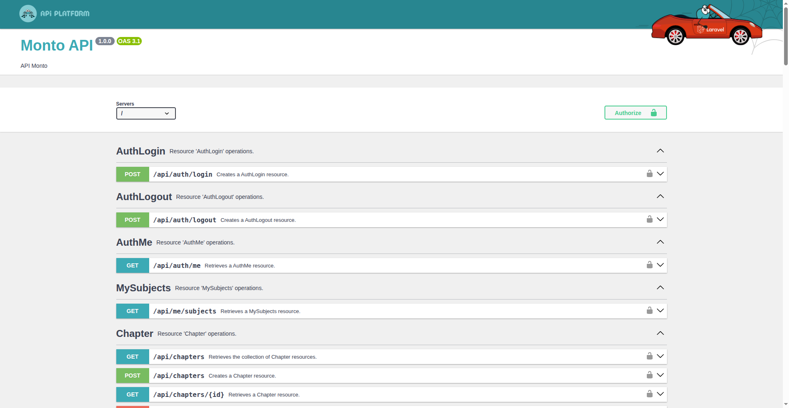

# 3 · Réalisations
<div class="text-base opacity-70 mt-2">Environnement · Interfaces · Métier · Accès données · Sécurité</div>

<!--
**[RÉALISATIONS]** Ce qui est développé et fonctionne aujourd'hui.

- On déroule : environnement, interfaces, composants métier, données, sécurité
- À chaque fois : une capture ou un extrait de code réel
-->

---
layout: default
---

# Environnement de travail

<div class="grid grid-cols-2 gap-8 mt-2">

<div>

### Stack conteneurisée (Docker Compose)

<div class="text-sm flex flex-col gap-2">
  <div class="mm-card"><code>nginx:1.27</code> → <code>php-fpm</code> (Laravel 12 · PHP 8.2)</div>
  <div class="mm-card"><code>mariadb:11</code> · <code>redis:7</code> · <code>phpmyadmin</code></div>
  <div class="mm-card">Un <code>docker compose up</code> = environnement complet, reproductible</div>
</div>

### Outillage

- **Backend** : Composer, Artisan, PHPUnit
- **Web** : pnpm, Angular CLI, Vitest, `@ngx-env`
- **Mobile** : pnpm, Expo CLI
- **Versionnage** : Git + GitHub (branches, PR)

</div>

<div>



<div class="text-xs opacity-60 mt-2">
Variables d'env : <code>NG_APP_*</code> (web), <code>src/constants/env.ts</code> (mobile).
</div>

</div>

</div>

<!--
**[ENVIRONNEMENT]** Stack entièrement conteneurisée — un seul `docker compose up`.

- **nginx + php-fpm** (Laravel 12), **MariaDB**, **Redis**, **phpMyAdmin**
- Reproductibilité : même stack en local et en intégration, zéro « ça marche sur ma machine »
- Clients branchés via variable d'env `NG_APP_BACKEND_URL` — bascule local/prod triviale
- Tout versionné sous Git avec workflow branches + PR

→ Les clients se branchent sur l'API sans configuration manuelle.
-->

---
layout: default
---

# Architecture MVC — Laravel + API Platform



<!--
**[MVC LARAVEL]** Cycle de vie d'une requête HTTP dans notre backend.

**Router** → définit les endpoints (`/api/videos`, etc.) depuis les attributs PHP `#[ApiResource]`

**Gate RBAC** → 30+ gates vérifient qui a le droit de faire quoi avant d'aller plus loin

**Controller** → `ApiPlatformController` délègue à :
- un **Provider** pour les `GET` : filtre les collections par rôle
- un **Processor** pour les `POST/PATCH/DELETE` : applique la logique métier

**Model / Eloquent** → interagit avec MariaDB ; Redis pour les nonces anti-triche

**Serializer** → convertit le modèle en JSON, génère la doc OpenAPI automatiquement

→ Chaque couche a une responsabilité unique — facile à tester, facile à faire évoluer.
-->

---

# Interfaces utilisateur — parcours élève

<div class="grid grid-cols-2 gap-4 mt-2">

<div>

{class="rounded-lg shadow-xl border border-gray-700 max-h-[62vh]"}

<div class="text-xs opacity-60 text-center mt-1">Catalogue — cartes par matière, code couleur catégorie</div>

</div>

<div>

{class="rounded-lg shadow-xl border border-gray-700 max-h-[62vh]"}

<div class="text-xs opacity-60 text-center mt-1">Ma progression — KPIs certifiés + avancement par matière</div>

</div>

</div>

<!--
**[INTERFACES ÉLÈVE]** Écrans réels du parcours élève, en production.

- **Catalogue** : cartes par matière, code couleur par catégorie, recherche + filtres
- **Ma progression** : KPIs certifiés et avancement par matière
- Honnêteté : le moteur de validation est codé et testé — le bout-en-bout est en finalisation
- Ce qui reste : relier le contenu vidéo affiché à la clé de progression

→ Identifié et planifié dans la roadmap, on préfère le dire clairement.
-->

---

# Interfaces — cours & lecteur contrôlé

<div class="grid grid-cols-2 gap-4 mt-2">

<div>

{class="rounded-lg shadow-xl border border-gray-700 max-h-[62vh]"}

<div class="text-xs opacity-60 text-center mt-1">Cours — sommaire (vidéo · PDF · article) + progression</div>

</div>

<div>

{class="rounded-lg shadow-xl border border-gray-700 max-h-[62vh]"}

<div class="text-xs opacity-60 text-center mt-1">Lecteur contrôlé — support YouTube IFrame + suivi</div>

</div>

</div>

<div class="text-xs opacity-60 text-center mt-2">
L'application <b>mobile (Expo)</b> reprend ces mêmes écrans en parité, avec le lecteur <code>expo-video</code>.
</div>

<!--
**[LECTEUR]** Cours et lecteur contrôlé — anti-triche même sur YouTube.

- **Page de cours** : sommaire vidéos + PDF + articles markdown, progression du chapitre
- **Lecteur** : vidéos hébergées et YouTube IFrame — contrôle anti-triche conservé
- Restrictions actives : lecture active requise, vitesse bridée, **anti-seek**
- Mobile : mêmes écrans avec le lecteur `expo-video`

→ Étendre la complétion aux PDF et markdown est déjà cadré en roadmap.
-->

---

# Interfaces — composants partagés web / mobile

<div class="grid grid-cols-2 gap-6 mt-2 text-sm">

<div>

Web et mobile partagent **la même structure logique** (schémas Zod, API, stores, guards) et une **bibliothèque de composants** miroir.

<div class="flex flex-col gap-2 mt-2">
  <div class="mm-card"><b style="color:#c084fc">🌐 shared/ui/</b> — <code>video-player</code>, <code>markdown-view</code>, <code>pdf-viewer</code>, <code>empty-state</code>…</div>
  <div class="mm-card"><b style="color:#34d399">📱 src/ui/</b> — <code>VideoPlayer</code>, <code>MarkdownView</code>, <code>PdfViewer</code>, <code>EmptyState</code>…</div>
</div>

</div>

<div>

Même validation Zod des deux côtés :

```ts
// web : opérateur RxJS
parseHydraCollection(FormationSchema)
// → map(r => schema.parse(r).member)

// mobile : fonction pure
parseHydraCollection(FormationSchema, raw)
// → schema.parse(raw).member
```

<div class="text-xs opacity-60 mt-2">
Différenciation : <b>signals</b> (web) vs <b>zustand</b> (mobile), <b>RxJS</b> vs <b>async/await</b>.
</div>

</div>

</div>

<!--
**[PARITÉ WEB/MOBILE]** Web et mobile partagent la même structure logique.

- **Zod**, couche API, stores, guards de rôle — identiques des deux côtés
- Bibliothèque miroir : `video-player`, `markdown-view`, `pdf-viewer`
- Réponses API validées par le **même schéma Zod** — erreurs tôt et explicites
- Différence idiomatique seulement : **signals/RxJS** vs **zustand/async-await**

→ Comprendre un domaine d'un côté permet de naviguer l'autre immédiatement.
-->

---
layout: section
transition: slide-up
---

# Composants métier
<div class="text-base opacity-70 mt-2">State Processors · Services — la logique applicative</div>

<!--
**[COMPOSANTS MÉTIER]** Où vit réellement la logique applicative.

- Deux exemples : le **pattern de mutation** DTO → Processor, puis l'**anti-triche**
-->

---

# Le pattern de mutation — DTO → Processor

<div class="grid grid-cols-2 gap-6 mt-2">

<div>

```php {all|1-5|7-10|12-14}
class AuthLoginProcessor
  implements ProcessorInterface
{
  public function process(
    mixed $data, Operation $op, ...
  ): JsonResponse {
    // $data = DTO validé
    $user = User::where('email', $data->email)
      ->first();
    if (!$user || !Hash::check(
        $data->password, $user->password)) {
      throw new AuthenticationException();
    }
    $token = $user->createToken('api-token')
      ->plainTextToken;
    return new JsonResponse([...]);
  }
}
```

</div>

<div class="text-sm flex flex-col gap-3 mt-4">

<div class="mm-card">
<b style="color:#7bd0ff">1 · DTO d'entrée</b><br>
Forme & validation du payload, découplé du modèle.
</div>
<div class="mm-card">
<b style="color:#c084fc">2 · State Processor</b><br>
Reçoit le DTO, applique la règle métier, persiste.
</div>
<div class="mm-card">
<b style="color:#34d399">3 · State Provider</b><br>
Personnalise la lecture (filtrage par propriétaire).
</div>

<div class="text-xs opacity-60">
Aucun contrôleur REST classique : l'API est déclarée sur les modèles.
</div>

</div>

</div>

<!--
**[PATTERN MUTATION]** DTO → Processor — trois couches, illustrées par le login.

- **DTO d'entrée** : porte la forme et la validation, découplé du modèle Eloquent
- **State Processor** : reçoit le DTO validé, applique la règle métier, persiste
- **State Provider** : côté lecture, filtre par propriétaire
- Aucun contrôleur REST classique — l'API est déclarée sur les modèles

→ Chaque endpoint est testable de façon isolée.
-->

---

# Composant métier phare — l'anti-triche

<div class="grid grid-cols-2 gap-6 mt-2">

<div>

```php {all|1-4|6-7|9-11}
// WatchTokenService — clé signée par segment
$payload = ['uid'=>$u, 'vid'=>$v,
  'seg_start'=>$s, 'seg_end'=>$e,
  'iat'=>now(), 'nonce'=>random()];

$token = base64($payload) . '.' .
  hash_hmac('sha256', $payload, $secret);

// nonce en Redis, TTL court, à usage unique
Cache::put("watch_nonce:$nonce",
  'pending', $ttl);
```

</div>

<div class="text-sm flex flex-col gap-2">

<div class="mm-card" style="border-color:#f87171">
<b style="color:#f87171">Problème résolu</b><br>
Sans contrôle serveur, un <code>curl</code> certifie 1 h de visionnage.
</div>

<div class="mm-card"><b style="color:#7bd0ff">Signature HMAC-SHA256</b> — toute altération invalide le token.</div>
<div class="mm-card"><b style="color:#7bd0ff">Anti-rejeu</b> — nonce <code>pending → used</code>, usage unique.</div>
<div class="mm-card"><b style="color:#7bd0ff">Fenêtre temporelle</b> — ni trop tôt, ni trop tard.</div>

</div>

</div>

<!--
**[ANTI-TRICHE]** Le composant phare — sans contrôle serveur, un `curl` certifie 1 h.

- **Signature HMAC-SHA256** : toute altération du payload invalide le token
- **Anti-rejeu** : nonce Redis `pending → used`, usage unique
- **Fenêtre temporelle** : ni trop tôt, ni trop tard
- Le temps validé est **prouvé**, jamais déclaratif

→ Chaque garde-fou a son test d'attaque dédié — on le montrera en partie tests.
-->

---
layout: section
transition: slide-up
---

# Composants d'accès aux données
<div class="text-base opacity-70 mt-2">SQL (Eloquent / MariaDB) & NoSQL (Redis)</div>

<!--
**[DONNÉES]** Deux technologies, chacune pour un usage légitime.

- **SQL** avec Eloquent + MariaDB, **NoSQL** avec Redis
-->

---

# Accès SQL — Eloquent + API Platform

<div class="grid grid-cols-2 gap-6 mt-2">

<div>

La ressource est déclarée sur le **modèle Eloquent**, le **Provider** restreint la lecture au propriétaire.

```php {all|1-2|4-8}
// State Provider — isolation par user_id
public function provide($op, ...): iterable
{
  $user = $request->user();
  if ($user->isAdmin())
    return VideoProgress::all();

  return VideoProgress::where(
    'user_id', $user->id)->get();
}
```

</div>

<div>

```php {all|1-5|6-9}
#[ApiResource(operations: [
  new GetCollection(
    uriTemplate: '/video-progress',
    provider: ...CollectionProvider::class,
  ),
  new Patch(
    input: ...UpdateInput::class,
    processor: ...UpdateProcessor::class,
  ),
])]
class VideoProgress extends Model { /* … */ }
```

<div class="text-xs opacity-60 mt-2">
Relations Eloquent (<code>belongsTo</code> / <code>hasMany</code>), migrations versionnées, <b>SoftDeletes</b>.
</div>

</div>

</div>

<!--
**[SQL]** Eloquent + API Platform — l'accès données côté relationnel.

- Ressource déclarée sur le modèle : `GetCollection`, `Patch`, chacun câblé à son provider
- **State Provider** restreint la lecture : admin voit tout, élève voit seulement `user_id = soi`
- L'isolation est **imposée à la source** — pas une option côté client
- Relations Eloquent, migrations versionnées, **SoftDeletes**

→ Aucune donnée métier n'est jamais supprimée définitivement.
-->

---

# Accès NoSQL — Redis

<div class="grid grid-cols-2 gap-6 mt-2">

<div>

Redis (clé-valeur) porte l'**état éphémère** de l'anti-triche : les **nonces** des clés temporelles, hors base relationnelle.

```php {all|1-2|4-6|8-9}
// émission : nonce "en attente", TTL court
Cache::put("watch_nonce:$nonce", 'pending', $ttl);

// validation : lecture de l'état
$status = Cache::get("watch_nonce:$nonce");
// null = expiré · 'used' = rejeu

// consommation : usage unique
Cache::put("watch_nonce:$nonce", 'used', 300);
```

</div>

<div class="text-sm flex flex-col gap-2">

<div class="mm-card"><b style="color:#34d399">Le bon outil</b><br>Des entrées à durée de vie courte, à très forte rotation → clé-valeur en mémoire, pas du SQL.</div>
<div class="mm-card"><b style="color:#7bd0ff">TTL natif</b><br>L'expiration des clés est gérée par Redis lui-même.</div>
<div class="mm-card"><b style="color:#c084fc">Aussi</b><br>Cache applicatif & sessions (config / route cache).</div>

</div>

</div>

<!--
**[REDIS]** Le bon outil pour le bon besoin — état éphémère anti-triche.

- Les nonces ont une durée de vie courte et une forte rotation → pas du SQL
- **TTL natif** géré par Redis lui-même — zéro job de nettoyage
- Cycle de vie : `pending` → lecture à la validation → `used`
- `null` = expiré, `used` = rejeu — refus immédiat

→ Redis sert aussi au cache applicatif et aux sessions.
-->

---

# Autres composants — contrôleur & API exposée

<div class="grid grid-cols-2 gap-5 mt-2">

<div>

Quelques endpoints sortent du CRUD et utilisent un **contrôleur dédié** (`WatchSessionController`, `AggregateController`, `UserSchoolController`) :

```php
Route::middleware('auth:sanctum')
  ->prefix('watch-sessions')->group(function () {
    Route::post('/request',   [WatchSessionController::class, 'request']);
    Route::post('/heartbeat', [WatchSessionController::class, 'heartbeat']);
});
```

<div class="text-xs opacity-60 mt-1">
Utilitaires côté client : intercepteurs (Bearer / 401), <code>parseResponse</code>, <code>utils/iri</code>.
</div>

</div>

<div>

{class="rounded-lg shadow-xl border border-gray-700 max-h-[58vh]"}

<div class="text-xs opacity-60 text-center mt-1">Documentation OpenAPI générée automatiquement</div>

</div>

</div>

<!--
**[API EXPOSÉE]** Tout n'est pas du CRUD — des contrôleurs dédiés pour les cas complexes.

- `WatchSessionController` : routes `request` et `heartbeat` sous `auth:sanctum`
- `AggregateController` : statistiques formateur, `UserSchoolController` : multi-écoles
- **OpenAPI générée automatiquement** — toujours à jour, sert de contrat partagé
- Côté client : intercepteurs Bearer + 401, utilitaires `parseResponse` et `iri`

→ La doc Swagger est la source de vérité pour les deux clients.
-->

---
layout: section
transition: slide-up
---

# Sécurité de l'application
<div class="text-base opacity-70 mt-2">Authentification · Autorisation · Anti-fraude</div>

<!--
**[SÉCURITÉ]** Dernier volet — trois plans : auth, autorisation RBAC, anti-fraude.
-->

---

# Authentification & autorisation

<div class="grid grid-cols-2 gap-6 mt-2">

<div>

### Sanctum — tokens Bearer

- `/auth/login` émet un token, persisté côté client
- Toutes les routes protégées par `middleware: auth:sanctum`

### RBAC — Gates centralisées

```php
Gate::define('subjects.view',
  function (User $u, $subject) {
    if ($u->isAdmin()) return true;
    if ($u->role === ROLE_TEACHER)
      return $subject->teacher_id === $u->id;
    if ($u->role === ROLE_STUDENT)
      return $subject->classrooms()
        ->where('id', $u->classroom_id)->exists();
    return false;
  });
```

</div>

<div class="text-sm flex flex-col gap-2">

<div class="mm-card"><b style="color:#f87171">admin</b> — accès total</div>
<div class="mm-card"><b style="color:#c084fc">teacher</b> — ses matières + contenus liés</div>
<div class="mm-card"><b style="color:#34d399">student</b> — contenus de sa classe ; progression filtrée sur <code>user_id</code></div>

<div class="mm-card text-xs" style="border-color:#7bd0ff">
30+ Gates · isolation des données par école / classe · référencées par le champ <code>policy</code> de chaque opération.
</div>

</div>

</div>

<!--
**[AUTH + RBAC]** Sanctum pour l'auth, Gates centralisées pour les rôles.

- Token Bearer émis au login, stocké : `localStorage` web, `SecureStore` mobile
- Toutes les routes protégées par `middleware: auth:sanctum`
- **30+ Gates RBAC** centralisées — pas éparpillées dans les contrôleurs
- Exemple : `subjects.view` — admin voit tout, teacher ses matières, student sa classe

→ Isolation par école et par classe imposée de façon cohérente sur toute l'API.
-->

---

# Sécurité — l'anti-fraude en défense en profondeur

<div class="grid grid-cols-2 gap-6 mt-4 text-sm">

<div class="mm-card">
<b style="color:#7bd0ff">Côté client</b><br>
Lecture active requise · vitesse bridée (≤ 2x web / 1x mobile) · anti-seek · pause si onglet masqué.
</div>

<div class="mm-card">
<b style="color:#7bd0ff">Signature serveur</b><br>
Clé HMAC-SHA256 par segment ; le client ne peut pas la forger.
</div>

<div class="mm-card">
<b style="color:#7bd0ff">Anti-rejeu</b><br>
Nonce à usage unique en Redis : rejouer une clé → <code>422</code>.
</div>

<div class="mm-card">
<b style="color:#7bd0ff">Fenêtre temporelle</b><br>
Soumission contrainte dans le temps ; impossible de batcher les clés.
</div>

</div>

<div class="mm-card mt-4 text-xs" style="border-color:#f87171">
<b style="color:#f87171">Principe :</b> le temps « validé » n'est <b>jamais</b> accepté tel quel — il n'est crédité que par consommation d'une clé serveur valide, et borné à la durée réelle de la vidéo.
</div>

<!--
**[DÉFENSE EN PROFONDEUR]** Aucune couche ne suffit seule — elles se combinent.

- **Client** : lecture active, vitesse bridée, anti-seek, pause si onglet masqué
- **Signature HMAC** serveur : le client ne peut rien forger
- **Anti-rejeu** : nonce à usage unique, rejeu → `422`
- **Fenêtre temporelle** : impossible de batcher les clés
- Le temps est **toujours borné** à la durée réelle de la vidéo

→ On passe au plan de tests, qui prouve que tout ça tient.
-->

