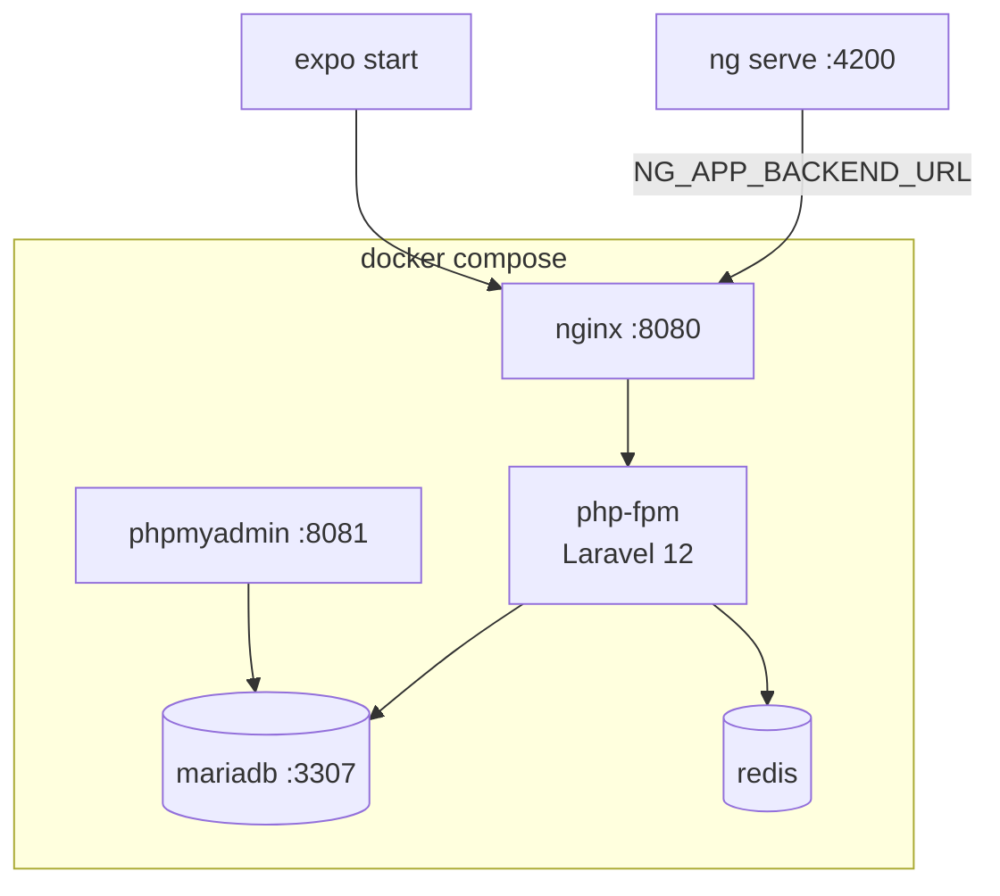

# 3 · Réalisations
<div class="text-base opacity-70 mt-2">Environnement · Interfaces · Métier · Accès données · Sécurité</div>

<!--
On arrive à la partie la plus concrète : ce qui est réellement développé et fonctionne aujourd'hui. On va dérouler l'environnement, les interfaces, les composants métier, l'accès aux données, puis la sécurité — avec à chaque fois soit une capture, soit un extrait de code réel.
-->

---
layout: default
---

# Environnement de travail

<div class="grid grid-cols-2 gap-8 mt-2">

<div>

### Stack conteneurisée (Docker Compose)

<div class="text-sm flex flex-col gap-2">
  <div class="mm-card"><code>nginx:1.27</code> → <code>php-fpm</code> (Laravel 12 · PHP 8.2)</div>
  <div class="mm-card"><code>mariadb:11</code> · <code>redis:7</code> · <code>phpmyadmin</code></div>
  <div class="mm-card">Un <code>docker compose up</code> = environnement complet, reproductible</div>
</div>

### Outillage

- **Backend** : Composer, Artisan, PHPUnit
- **Web** : pnpm, Angular CLI, Vitest, `@ngx-env`
- **Mobile** : pnpm, Expo CLI
- **Versionnage** : Git + GitHub (branches, PR)

</div>

<div>



<div class="text-xs opacity-60 mt-2">
Variables d'env : <code>NG_APP_*</code> (web), <code>src/constants/env.ts</code> (mobile).
</div>

</div>

</div>

<!--
Notre environnement est entièrement conteneurisé avec Docker Compose. Un seul « docker compose up » lève toute la stack backend : nginx en frontal, php-fpm avec Laravel 12, MariaDB, Redis, et phpMyAdmin pour l'inspection. L'intérêt, c'est la reproductibilité — la même stack en local et en intégration, sans le syndrome du « ça marche sur ma machine ». Côté outillage : Composer, Artisan et PHPUnit pour le backend ; pnpm, Angular CLI et Vitest pour le web ; pnpm et Expo CLI pour le mobile. Les clients se branchent sur l'API via une variable d'environnement — NG_APP_BACKEND_URL côté web — ce qui rend le basculement local/prod trivial. Tout est versionné sous Git avec un workflow de branches et de PR.
-->

---

# Interfaces utilisateur — parcours élève

<div class="grid grid-cols-2 gap-4 mt-2">

<div>

{class="rounded-lg shadow-xl border border-gray-700 max-h-[62vh]"}

<div class="text-xs opacity-60 text-center mt-1">Catalogue — cartes par matière, code couleur catégorie</div>

</div>

<div>

{class="rounded-lg shadow-xl border border-gray-700 max-h-[62vh]"}

<div class="text-xs opacity-60 text-center mt-1">Ma progression — KPIs certifiés + avancement par matière</div>

</div>

</div>

<!--
Voici les écrans réels du parcours élève, en production. À gauche, le catalogue des matières : des cartes avec un code couleur par catégorie, une recherche et des filtres. À droite, l'écran « ma progression » avec ses KPI et l'avancement par matière. On sera honnêtes avec le jury sur un point : l'affichage est branché et fonctionnel, mais le remplissage automatique de la progression de bout en bout est encore en cours de finalisation côté backend — le moteur de validation du temps est codé et testé, ce qui reste c'est de relier le contenu vidéo affiché à la clé de progression. C'est identifié et planifié dans la roadmap. On préfère le dire clairement plutôt que de survendre.
-->

---

# Interfaces — cours & lecteur contrôlé

<div class="grid grid-cols-2 gap-4 mt-2">

<div>

{class="rounded-lg shadow-xl border border-gray-700 max-h-[62vh]"}

<div class="text-xs opacity-60 text-center mt-1">Cours — sommaire (vidéo · PDF · article) + progression</div>

</div>

<div>

{class="rounded-lg shadow-xl border border-gray-700 max-h-[62vh]"}

<div class="text-xs opacity-60 text-center mt-1">Lecteur contrôlé — support YouTube IFrame + suivi</div>

</div>

</div>

<div class="text-xs opacity-60 text-center mt-2">
L'application <b>mobile (Expo)</b> reprend ces mêmes écrans en parité, avec le lecteur <code>expo-video</code>.
</div>

<!--
La page de cours, à gauche : un sommaire qui mêle vidéos, PDF et articles markdown, avec la progression du chapitre. À droite, le lecteur contrôlé — il supporte à la fois les vidéos hébergées et l'intégration YouTube via l'IFrame API, ce qui nous a permis de garder le contrôle anti-triche même sur du contenu YouTube : lecture active requise, vitesse bridée, anti-seek. Le mobile reprend exactement ces écrans, avec le lecteur expo-video. Un mot sur les types de contenu : aujourd'hui, la progression d'un chapitre se calcule sur les vidéos ; étendre la complétion aux PDF et au markdown est une évolution déjà cadrée dans la roadmap backend.
-->

---

# Interfaces — composants partagés web / mobile

<div class="grid grid-cols-2 gap-6 mt-2 text-sm">

<div>

Web et mobile partagent **la même structure logique** (schémas Zod, API, stores, guards) et une **bibliothèque de composants** miroir.

<div class="flex flex-col gap-2 mt-2">
  <div class="mm-card"><b style="color:#c084fc">🌐 shared/ui/</b> — <code>video-player</code>, <code>markdown-view</code>, <code>pdf-viewer</code>, <code>empty-state</code>…</div>
  <div class="mm-card"><b style="color:#34d399">📱 src/ui/</b> — <code>VideoPlayer</code>, <code>MarkdownView</code>, <code>PdfViewer</code>, <code>EmptyState</code>…</div>
</div>

</div>

<div>

Même validation Zod des deux côtés :

```ts
// web : opérateur RxJS
parseHydraCollection(FormationSchema)
// → map(r => schema.parse(r).member)

// mobile : fonction pure
parseHydraCollection(FormationSchema, raw)
// → schema.parse(raw).member
```

<div class="text-xs opacity-60 mt-2">
Différenciation : <b>signals</b> (web) vs <b>zustand</b> (mobile), <b>RxJS</b> vs <b>async/await</b>.
</div>

</div>

</div>

<!--
Cette diapo concrétise la parité dont on parle depuis le début. Web et mobile partagent la même structure logique : schémas Zod, couche API, stores, guards de rôle, et une bibliothèque de composants en miroir — video-player, markdown-view, pdf-viewer des deux côtés. Point clé sur la fiabilité : toutes les réponses de l'API sont validées par le même schéma Zod, web et mobile — si l'API renvoie une forme inattendue, ça casse tôt et explicitement, pas silencieusement. La seule différence est idiomatique : signals et RxJS côté Angular, zustand et async/await côté React Native. Concrètement, comprendre un domaine d'un côté permet de naviguer l'autre immédiatement.
-->

---
layout: section
transition: slide-up
---

# Composants métier
<div class="text-base opacity-70 mt-2">State Processors · Services — la logique applicative</div>

<!--
On entre dans les composants métier : où vit réellement la logique applicative. Deux exemples — le pattern de mutation, puis le composant phare : l'anti-triche.
-->

---

# Le pattern de mutation — DTO → Processor

<div class="grid grid-cols-2 gap-6 mt-2">

<div>

```php {all|1-5|7-10|12-14}
class AuthLoginProcessor
  implements ProcessorInterface
{
  public function process(
    mixed $data, Operation $op, ...
  ): JsonResponse {
    // $data = DTO validé
    $user = User::where('email', $data->email)
      ->first();
    if (!$user || !Hash::check(
        $data->password, $user->password)) {
      throw new AuthenticationException();
    }
    $token = $user->createToken('api-token')
      ->plainTextToken;
    return new JsonResponse([...]);
  }
}
```

</div>

<div class="text-sm flex flex-col gap-3 mt-4">

<div class="mm-card">
<b style="color:#7bd0ff">1 · DTO d'entrée</b><br>
Forme & validation du payload, découplé du modèle.
</div>
<div class="mm-card">
<b style="color:#c084fc">2 · State Processor</b><br>
Reçoit le DTO, applique la règle métier, persiste.
</div>
<div class="mm-card">
<b style="color:#34d399">3 · State Provider</b><br>
Personnalise la lecture (filtrage par propriétaire).
</div>

<div class="text-xs opacity-60">
Aucun contrôleur REST classique : l'API est déclarée sur les modèles.
</div>

</div>

</div>

<!--
Voici notre pattern de mutation, illustré par le login. Il se lit en trois couches. Un, le DTO d'entrée : un objet qui porte la forme et la validation du payload, totalement découplé du modèle Eloquent. Deux, le State Processor : il reçoit ce DTO déjà validé, applique la règle métier — ici vérifier l'email et le hash du mot de passe, puis émettre un token Sanctum — et persiste. Trois, le State Provider, côté lecture, qui personnalise la récupération, typiquement en filtrant par propriétaire. La force de ce pattern : il n'y a aucun contrôleur REST classique, l'API est déclarée directement sur les modèles via ApiResource, et la validation est systématiquement séparée de la logique. Ça rend chaque endpoint testable de façon isolée — ce qu'on exploite dans la suite de tests.
-->

---

# Composant métier phare — l'anti-triche

<div class="grid grid-cols-2 gap-6 mt-2">

<div>

```php {all|1-4|6-7|9-11}
// WatchTokenService — clé signée par segment
$payload = ['uid'=>$u, 'vid'=>$v,
  'seg_start'=>$s, 'seg_end'=>$e,
  'iat'=>now(), 'nonce'=>random()];

$token = base64($payload) . '.' .
  hash_hmac('sha256', $payload, $secret);

// nonce en Redis, TTL court, à usage unique
Cache::put("watch_nonce:$nonce",
  'pending', $ttl);
```

</div>

<div class="text-sm flex flex-col gap-2">

<div class="mm-card" style="border-color:#f87171">
<b style="color:#f87171">Problème résolu</b><br>
Sans contrôle serveur, un <code>curl</code> certifie 1 h de visionnage.
</div>

<div class="mm-card"><b style="color:#7bd0ff">Signature HMAC-SHA256</b> — toute altération invalide le token.</div>
<div class="mm-card"><b style="color:#7bd0ff">Anti-rejeu</b> — nonce <code>pending → used</code>, usage unique.</div>
<div class="mm-card"><b style="color:#7bd0ff">Fenêtre temporelle</b> — ni trop tôt, ni trop tard.</div>

</div>

</div>

<!--
C'est le composant dont on est le plus fiers. Le problème à résoudre : sans contrôle serveur, n'importe qui peut certifier une heure de visionnage avec un simple curl. Notre réponse, le WatchTokenService. À chaque demande de segment, le serveur construit un payload — utilisateur, vidéo, bornes du segment, horodatage, et un nonce aléatoire — puis le signe en HMAC-SHA256 avec un secret serveur. Trois garde-fous en découlent. La signature : toute altération du payload invalide le token, le client ne peut rien forger. L'anti-rejeu : le nonce est stocké en Redis et passe de « pending » à « used » à la première consommation, donc rejouer une clé est refusé. Et la fenêtre temporelle : le heartbeat doit arriver ni trop tôt — sinon on n'a pas vraiment regardé — ni trop tard. Résultat : le temps validé n'est jamais déclaratif, il est prouvé. Et chacun de ces garde-fous a son test d'attaque dédié, on le montrera en partie tests.
-->

---
layout: section
transition: slide-up
---

# Composants d'accès aux données
<div class="text-base opacity-70 mt-2">SQL (Eloquent / MariaDB) & NoSQL (Redis)</div>

<!--
La compétence « accès aux données » du référentiel demande explicitement du SQL et du NoSQL. On a les deux, et chacun pour un usage qui lui est légitime — on va le montrer.
-->

---

# Accès SQL — Eloquent + API Platform

<div class="grid grid-cols-2 gap-6 mt-2">

<div>

La ressource est déclarée sur le **modèle Eloquent**, le **Provider** restreint la lecture au propriétaire.

```php {all|1-2|4-8}
// State Provider — isolation par user_id
public function provide($op, ...): iterable
{
  $user = $request->user();
  if ($user->isAdmin())
    return VideoProgress::all();

  return VideoProgress::where(
    'user_id', $user->id)->get();
}
```

</div>

<div>

```php {all|1-5|6-9}
#[ApiResource(operations: [
  new GetCollection(
    uriTemplate: '/video-progress',
    provider: ...CollectionProvider::class,
  ),
  new Patch(
    input: ...UpdateInput::class,
    processor: ...UpdateProcessor::class,
  ),
])]
class VideoProgress extends Model { /* … */ }
```

<div class="text-xs opacity-60 mt-2">
Relations Eloquent (<code>belongsTo</code> / <code>hasMany</code>), migrations versionnées, <b>SoftDeletes</b>.
</div>

</div>

</div>

<!--
L'accès SQL repose sur Eloquent, l'ORM de Laravel, couplé à API Platform. À droite, la ressource est déclarée sur le modèle : on y voit les opérations GetCollection, Patch, etc., chacune câblée à son provider ou son processor. À gauche, le point important pour la sécurité des données : le State Provider restreint la lecture au propriétaire — un admin voit tout, mais un élève ne récupère que ses propres lignes de progression, via un where sur user_id. L'isolation des données n'est donc pas une option côté client, elle est imposée à la source, en base. On utilise les relations Eloquent classiques, des migrations versionnées, et les SoftDeletes pour ne jamais supprimer définitivement une donnée métier.
-->

---

# Accès NoSQL — Redis

<div class="grid grid-cols-2 gap-6 mt-2">

<div>

Redis (clé-valeur) porte l'**état éphémère** de l'anti-triche : les **nonces** des clés temporelles, hors base relationnelle.

```php {all|1-2|4-6|8-9}
// émission : nonce "en attente", TTL court
Cache::put("watch_nonce:$nonce", 'pending', $ttl);

// validation : lecture de l'état
$status = Cache::get("watch_nonce:$nonce");
// null = expiré · 'used' = rejeu

// consommation : usage unique
Cache::put("watch_nonce:$nonce", 'used', 300);
```

</div>

<div class="text-sm flex flex-col gap-2">

<div class="mm-card"><b style="color:#34d399">Le bon outil</b><br>Des entrées à durée de vie courte, à très forte rotation → clé-valeur en mémoire, pas du SQL.</div>
<div class="mm-card"><b style="color:#7bd0ff">TTL natif</b><br>L'expiration des clés est gérée par Redis lui-même.</div>
<div class="mm-card"><b style="color:#c084fc">Aussi</b><br>Cache applicatif & sessions (config / route cache).</div>

</div>

</div>

<!--
Le NoSQL, avec Redis, n'est pas là pour faire joli : il porte l'état éphémère de l'anti-triche. Les nonces des clés temporelles sont des entrées à durée de vie très courte et à très forte rotation — les stocker en base relationnelle serait un contresens. Redis, clé-valeur en mémoire, est l'outil exact pour ça, avec une expiration TTL native gérée par Redis lui-même. Le cycle de vie tient en trois lignes : on dépose le nonce en « pending » avec un TTL, on lit son état à la validation — null veut dire expiré, « used » veut dire rejeu — et on le consomme en le passant à « used ». Redis sert aussi de cache applicatif et pour les sessions. C'est notre justification du choix « le bon outil pour le bon besoin ».
-->

---

# Autres composants — contrôleur & API exposée

<div class="grid grid-cols-2 gap-5 mt-2">

<div>

Quelques endpoints sortent du CRUD et utilisent un **contrôleur dédié** (`WatchSessionController`, `AggregateController`, `UserSchoolController`) :

```php
Route::middleware('auth:sanctum')
  ->prefix('watch-sessions')->group(function () {
    Route::post('/request',   [WatchSessionController::class, 'request']);
    Route::post('/heartbeat', [WatchSessionController::class, 'heartbeat']);
});
```

<div class="text-xs opacity-60 mt-1">
Utilitaires côté client : intercepteurs (Bearer / 401), <code>parseResponse</code>, <code>utils/iri</code>.
</div>

</div>

<div>

{class="rounded-lg shadow-xl border border-gray-700 max-h-[58vh]"}

<div class="text-xs opacity-60 text-center mt-1">Documentation OpenAPI générée automatiquement</div>

</div>

</div>

<!--
Tout n'est pas du CRUD : certains besoins sortent du modèle ApiResource et passent par des contrôleurs dédiés — le WatchSessionController pour l'anti-triche, l'AggregateController pour les statistiques formateur, le UserSchoolController pour le rattachement multi-écoles. À gauche, les deux routes clés de l'anti-triche : request et heartbeat, sous middleware auth:sanctum. À droite, un atout d'API Platform : la documentation OpenAPI est générée automatiquement à partir des ressources — elle est toujours à jour, et c'est elle qui sert de contrat partagé entre le backend et les deux clients. Côté client, on s'appuie sur des intercepteurs pour le Bearer et la gestion des 401, et des utilitaires de parsing.
-->

---
layout: section
transition: slide-up
---

# Sécurité de l'application
<div class="text-base opacity-70 mt-2">Authentification · Autorisation · Anti-fraude</div>

<!--
La sécurité, dernier volet des réalisations, sur trois plans : l'authentification, l'autorisation par rôles, et l'anti-fraude en défense en profondeur.
-->

---

# Authentification & autorisation

<div class="grid grid-cols-2 gap-6 mt-2">

<div>

### Sanctum — tokens Bearer

- `/auth/login` émet un token, persisté côté client
- Toutes les routes protégées par `middleware: auth:sanctum`

### RBAC — Gates centralisées

```php
Gate::define('subjects.view',
  function (User $u, $subject) {
    if ($u->isAdmin()) return true;
    if ($u->role === ROLE_TEACHER)
      return $subject->teacher_id === $u->id;
    if ($u->role === ROLE_STUDENT)
      return $subject->classrooms()
        ->where('id', $u->classroom_id)->exists();
    return false;
  });
```

</div>

<div class="text-sm flex flex-col gap-2">

<div class="mm-card"><b style="color:#f87171">admin</b> — accès total</div>
<div class="mm-card"><b style="color:#c084fc">teacher</b> — ses matières + contenus liés</div>
<div class="mm-card"><b style="color:#34d399">student</b> — contenus de sa classe ; progression filtrée sur <code>user_id</code></div>

<div class="mm-card text-xs" style="border-color:#7bd0ff">
30+ Gates · isolation des données par école / classe · référencées par le champ <code>policy</code> de chaque opération.
</div>

</div>

</div>

<!--
L'authentification s'appuie sur Sanctum : le login émet un token Bearer, persisté côté client — localStorage sur le web, SecureStore sur mobile — et toutes les routes sont protégées par le middleware auth:sanctum. L'autorisation, elle, est centralisée dans des Gates RBAC, pas éparpillée. L'exemple à l'écran, subjects.view : un admin a tout, un teacher ne voit que les matières dont il est responsable, un student seulement celles de sa classe. On a plus de trente Gates de ce type, chacune référencée par le champ policy de l'opération concernée. C'est cette centralisation qui garantit l'isolation par école et par classe de façon cohérente sur toute l'API. On sera transparents en Q&A : un audit qu'on a mené a révélé quelques endpoints de liste où ce filtrage doit être renforcé — c'est tracé et priorisé dans la roadmap sécurité.
-->

---

# Sécurité — l'anti-fraude en défense en profondeur

<div class="grid grid-cols-2 gap-6 mt-4 text-sm">

<div class="mm-card">
<b style="color:#7bd0ff">Côté client</b><br>
Lecture active requise · vitesse bridée (≤ 2x web / 1x mobile) · anti-seek · pause si onglet masqué.
</div>

<div class="mm-card">
<b style="color:#7bd0ff">Signature serveur</b><br>
Clé HMAC-SHA256 par segment ; le client ne peut pas la forger.
</div>

<div class="mm-card">
<b style="color:#7bd0ff">Anti-rejeu</b><br>
Nonce à usage unique en Redis : rejouer une clé → <code>422</code>.
</div>

<div class="mm-card">
<b style="color:#7bd0ff">Fenêtre temporelle</b><br>
Soumission contrainte dans le temps ; impossible de batcher les clés.
</div>

</div>

<div class="mm-card mt-4 text-xs" style="border-color:#f87171">
<b style="color:#f87171">Principe :</b> le temps « validé » n'est <b>jamais</b> accepté tel quel — il n'est crédité que par consommation d'une clé serveur valide, et borné à la durée réelle de la vidéo.
</div>

<!--
On synthétise notre stratégie anti-fraude comme une défense en profondeur — aucune couche n'est censée suffire seule. Côté client : lecture active requise, vitesse bridée à 2x sur le web et 1x sur mobile, anti-seek, et pause automatique si l'onglet est masqué. Mais le client n'est jamais une source de confiance : par-dessus, la signature serveur HMAC que le client ne peut pas forger ; l'anti-rejeu par nonce à usage unique, qui répond 422 ; et la fenêtre temporelle qui empêche de batcher les clés. Le principe directeur, en bas : le temps validé n'est jamais accepté tel quel, il n'est crédité que par consommation d'une clé serveur valide, et toujours borné à la durée réelle de la vidéo. Ça clôt les réalisations ; on passe au plan de tests, qui prouve que tout ça tient.
-->

