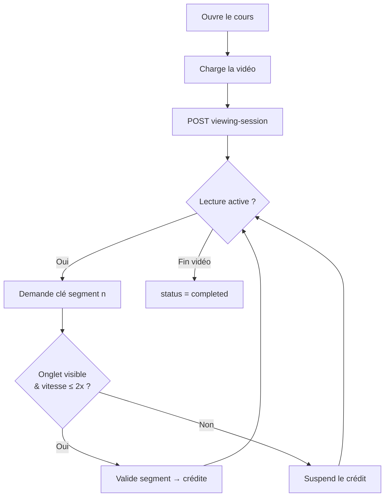
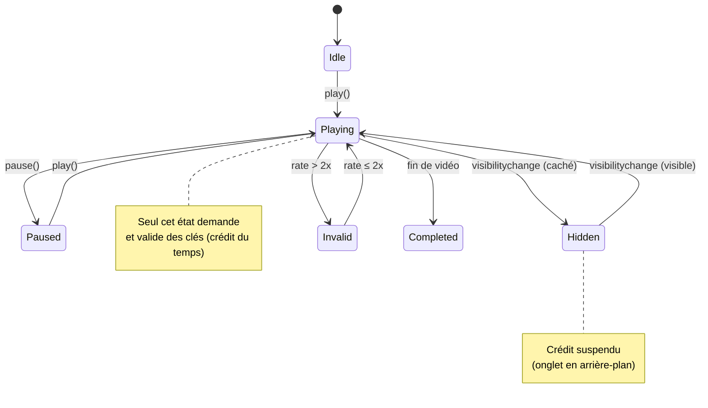
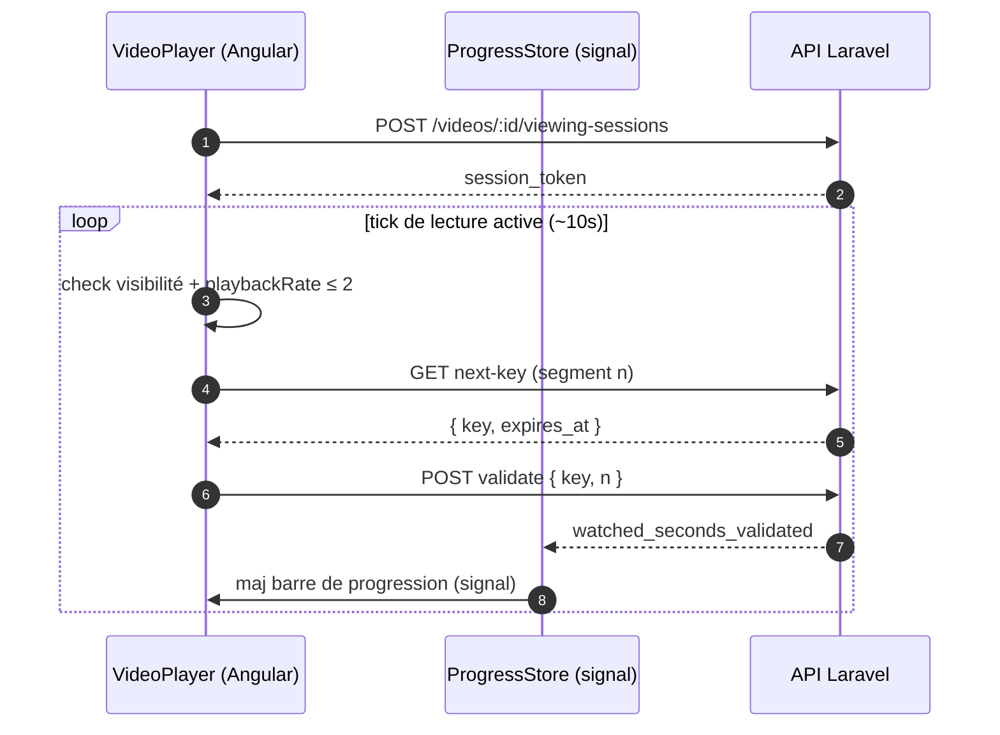
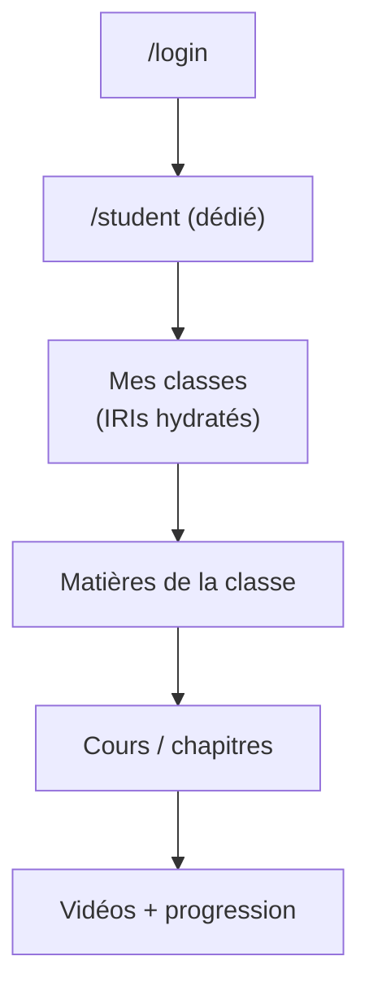

# 🌐 App Web

Angular 21 · signals · stores réactifs · Tailwind v4

---

# Web — état des lieux

### ✅ Déjà en place

- Routes lazy + `authGuard` / `roleGuard`
- Stores **signals** par domaine (auth, formation…)
- Espaces **teacher** & **admin**
- Parcours matières → cours → vidéos
- Lecteur `<video>` HTML5 de base

### 🔲 À construire

  
#22 · Lecteur vidéo <b>contrôlé</b> anti-triche P-high

  
#23 · Espace élève + classes attribuées

  
#24 · Dashboards formateur & école

Dépend de #18 (clés) et #15 (agrégation progression).

---
layout: section
transition: slide-up
---

# #22 · Lecteur contrôlé

L'anti-triche, côté navigateur

---

# #22 · User stories & userflow

<b style="color:#7bd0ff">En tant qu'</b>élève,
<b>je veux</b> que mon temps se valide quand je regarde vraiment,
<b>afin que</b> ma progression soit juste.

<b style="color:#c084fc">En tant que</b> plateforme,
<b>je veux</b> suspendre le crédit si l'onglet est masqué ou la vitesse > 2x.

---

# #22 · Machine à états du lecteur

Écouteurs : <code>play/pause/timeupdate/ratechange</code> + <code>document.visibilitychange</code>.

---

# #22 · Séquence client ↔ API

Nouveau <code>core/api/progress.api.ts</code> + <code>ProgressStore</code> ; le Bearer est ajouté par <code>jwtInterceptor</code>.

---
layout: two-cols
layoutClass: gap-8
---

# #23 · Espace élève + classes

L'élève passe aujourd'hui par un dashboard générique. On crée un **espace dédié** et on affiche ses **classes attribuées**.

<b style="color:#7bd0ff">User story</b> 
En tant qu'élève, je veux voir mes classes et naviguer vers leurs matières.

::right::

Routes protégées par <code>roleGuard('student')</code>.

---

# #24 · Dashboards de suivi

### User stories

<b style="color:#c084fc">Formateur</b> — suivre chaque élève : temps, %, statut, avancement par matière.

<b style="color:#34d399">École</b> — vision globale agrégée (toutes classes).

Consomme l'agrégation backend (#15).

### Maquette (layout)

┌────────────────────────────┐ 
│ Suivi · Classe 3A   [filtre]│ 
├──────────┬─────────┬────────┤ 
│ Élève    │ Matière │ %      │ 
├──────────┼─────────┼────────┤ 
│ A. Dupont│ Angular │ ▓▓▓▓░ 78│ 
│ B. Martin│ Angular │ ▓▓░░░ 41│ 
│ C. Leroy │ Laravel │ ▓▓▓▓▓ 96│ 
└──────────┴─────────┴────────┘

---

# Web — récap & dépendances

| Issue | Sujet | Dépend de |
|-------|-------|-----------|
| **#22** | Lecteur contrôlé anti-triche | Backend **#18** |
| **#23** | Espace élève + classes | — |
| **#24** | Dashboards formateur / école | Backend **#15** |

<b style="color:#c084fc">Note :</b> l'affichage de la progression élève est déjà cadré par l'épic <b>#16</b> ; #24 le prolonge côté encadrants.

