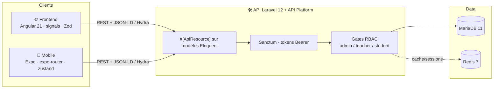
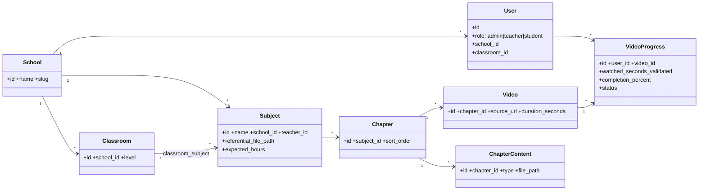

# MontoMaster V2

Roadmap technique — **Backend → Web → Mobile**

La plateforme e-learning nouvelle génération qui remplace Seira

  Laravel · API Platform
  Angular 21
  Expo / React Native

  Présentation pour développeurs · périmètre hors IA

<!--
Deck destiné aux devs : on parcourt ce qu'il reste à construire, par plateforme, avec schémas (classe, MLD/MPD, séquence, state, userflow). L'IA (transcription + RAG + chat) est volontairement hors périmètre de cette session.
-->

---
transition: fade-out
layout: two-cols
layoutClass: gap-12
---

# Sommaire

Trois plateformes, **une seule API**.
On déroule dans l'ordre des dépendances :

  
<b style="color:#7bd0ff">1 · Backend</b> — fondation, contrats, sécurité

  
<b style="color:#c084fc">2 · App Web</b> — Angular, consomme l'API

  
<b style="color:#34d399">3 · App Mobile</b> — Expo, miroir du web

---
transition: slide-left
---

# Vision & périmètre

### ✅ Dans le périmètre

- **Anti-triche** : validation serveur du temps de visionnage
- **Suivi pédagogique** : progression élève, dashboards
- **Gestion multi-écoles**, classes, matières, contenus
- **Sécurité & conformité** : RBAC, logs, RGPD
- **Lecteur vidéo contrôlé** (web + mobile)

### 🚫 Hors périmètre (cette session)

- Transcription automatique des vidéos
- Indexation & RAG
- Agent conversationnel / chat contextuel

<b style="color:#fbbf24">Pourquoi ?</b> 
La couche IA dépend d'une base saine : modèle de données, tracking certifié et contrats d'API stabilisés <em>d'abord</em>.

---
transition: slide-up
---

# Architecture — monorepo, une API

Web & mobile partagent <b>le même contrat OpenAPI</b> — schémas Zod côté clients, IRI → ids via <code>utils/iri</code>.

---
transition: slide-left
---

# Modèle de données — existant

8 entités · SoftDeletes actifs · <code>SCHEMA_BDD.md</code> = source de vérité

---
transition: fade
layout: center
class: text-center
---

# Comment lire ce deck

  ✅ Déjà codé
  ◑ Partiel
  🔲 À construire

  
📐 <b>classDiagram</b> — diagramme de classes

  
🗄️ <b>erDiagram</b> — MLD / MPD (Merise)

  
🔁 <b>sequenceDiagram</b> — flux client ↔ serveur

  
🔀 <b>stateDiagram</b> — machine à états

  
🧭 <b>flowchart</b> — userflow / parcours

  
👤 <b>User stories</b> — « En tant que… »

Chaque feature référence son issue GitHub (#18 → #26).

---
src: ./pages/backend.md
---

---
src: ./pages/web.md
---

---
src: ./pages/mobile.md
---

---
src: ./pages/cloture.md
---
